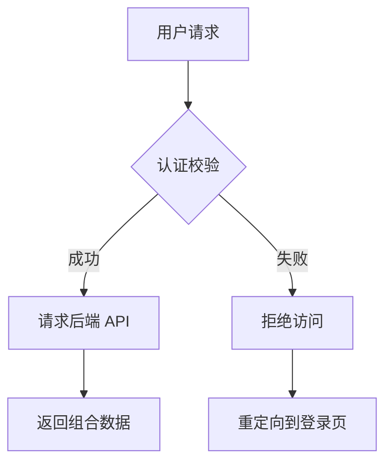

这篇文章展示了 Jekyll（基于 kramdown 解析器）所支持的绝大多数 markup 语法，用于测试主题样式或作为撰写文章的参考规范。

## 1. 基础排版 (Text Formatting)

这是普通的段落文本。你可以在段落中使用 **粗体文本**、*斜体文本*、***粗斜体***，或者删除线~~被划掉的内容~~。
还可以使用 `标记代码` (inline code)，或者添加脚注来补充说明[^1]。

通过 Kramdown 缩写扩展，你可以定义缩写，例如鼠标悬停在 HTML 上会显示全称。

*[HTML]: Hyper Text Markup Language

## 2. 标题层级 (Headings)

### 三级标题 (H3)

#### 四级标题 (H4)

##### 五级标题 (H5)

###### 六级标题 (H6)

> **技巧**：Jekyll 支持通过 `{: #custom-id}` 显式为标题自定义 ID。
{: #custom-heading-section}

## 3. 列表 (Lists)

### 无序列表

 * 顶级列表项 A
   * 二级列表项 A1
   * 二级列表项 A2
 * 顶级列表项 B
 * 顶级列表项 C

### 有序列表

 1. 第一步：准备 Jekyll 环境
 2. 第二步：编写 Markdown 文件
 3. 第三步：运行 `jekyll serve` 构建

### 任务列表 (Task Lists)

 * [x] 完成 Jekyll 配置文件设置
 * [x] 撰写示例 Markdown 文章
 * [ ] 部署到 GitHub Pages

## 4. 引用与块级元素 (Blockquotes)

> 这是一个单行块级引用 (Blockquote)。
> 
> > 这是一个嵌套的引用块。
> > 可以在这里提供出处或引申信息。

## 5. 代码高亮 (Code Blocks)

Jekyll 支持通过标准的 Markdown 语法高亮代码块。并且我们启用了 Rouge 的行号显示：

```javascript
// JavaScript 示例
function greet(name) {
    console.log(`Hello, ${name}! Welcome to Jekyll.`);
}

greet('Developer');
```

同时，Jekyll 原生支持 Liquid 的 `highlight` 标签：


# Python 示例
def calculate_factorial(n):
    if n == 0:
        return 1
    return n * calculate_factorial(n - 1)

print(f"Factorial of 5: {calculate_factorial(5)}")


## 6. 表格 (Tables)

这里展示了一个标准对齐方式的表格。

| 过滤器/属性 | 说明 | 示例输入 | 示例输出 |
|:---|:---|:---:|---:|
| `date_to_string` | 日期转为字符串 | `site.time` | 01 Aug 2026 |
| `upcase` | 字符转大写 | `"hello"` | HELLO |
| `size` | 获取数组或字符串长度 | `page.tags` | 4 |

## 7. 链接与媒体 (Links & Media)

 * [访问 Jekyll 官网](https://jekyllrb.com/){: target="_blank" rel="noopener"} *(含 Kramdown 扩展属性)*
 * [跳转到本文的特殊标题](#custom-heading-section) *(内部锚点)*

### 图片展示


*图：展示支持图片说明文本的效果*

## 8. Jekyll 特有扩展 (kramdown & Liquid)

### 属性列表 (Attribute Lists)

你可以直接给下一个元素添加 CSS 类名或内联样式：

这是一个带有自定义 CSS 类和背景样式的警告段落。
{: style="padding: 16px; border-left: 4px solid #f0ad4e; background: rgba(240, 173, 78, 0.1); border-radius: 4px;"}

### 定义列表 (Definition Lists)

Jekyll / Liquid
: 基于 Ruby 的静态网站生成器。

kramdown
: Jekyll 默认使用的 Markdown 解析引擎，支持丰富的扩展语法。
: 可以有多个解释。

### 数学公式 (LaTeX)

如果你的主题引入了 MathJax/KaTeX，可以渲染数学公式：

$$
E = mc^2
$$

### Liquid 变量调用示例

 * **本篇文章标题**：{{ page.title }}
 * **文章发布时间**：{{ page.date | date: "%Y年%m月%d日" }}
 * **标签数量**：{{ page.tags | size }} 个

## 9. GitHub Alerts (提示框)

我们通过自研的 AST 转换插件，原生支持了 GitHub 风格的 Alerts。在段落前加上 `> [!NOTE]` 等标记即可触发：

> [!NOTE]
> 这是一个 Note 提示框。用于强调一般性的补充信息。

> [!TIP]
> 这是一个 Tip 提示框。用于提供有用的建议或快捷方式。

> [!IMPORTANT]
> 这是一个 Important 提示框。用于向用户传达实现其目标必不可少的关键信息。

> [!WARNING]
> 这是一个 Warning 提示框。用于提醒用户注意潜在的风险。

> [!CAUTION]
> 这是一个 Caution 提示框。用于警告可能导致数据丢失或严重后果的高危操作。

## 10. 可折叠详情区 (Details & Summary)

你可以直接使用原生 HTML 的 `<details>` 和 `<summary>` 标签来包裹长文本或超长代码。我们已经为其适配了 MD3 风格的展开面板样式。

> [!TIP]
> 如果你想在 `<details>` 内部继续使用 Markdown 语法（如代码块、加粗等），必须在 `<details>` 标签上添加 `markdown="1"` 属性，并且在 `<summary>` 和内容之间**留一个空行**。

<details markdown="1">
<summary><b>点击展开查看详细构建日志</b></summary>

```bash
$ bundle exec jekyll build
Configuration file: /workspace/_config.yml
            Source: /workspace
       Destination: /workspace/_site
 Incremental build: disabled. Enable with --incremental
      Generating... 
       Jekyll Feed: Generating feed for posts
                    done in 0.548 seconds.
 Auto-regeneration: disabled. Use --watch to enable.
```

日志显示构建成功。
</details>

## 11. Mermaid 原生图表引擎

本博客内置了高性能、**按需懒加载 (Lazy Load)** 的 Mermaid 渲染支持。你只需要用标准的代码块并指定语言为 `mermaid` 即可绘制流程图、时序图、甘特图等。



## 12. 颜色色块自动预览 (Color Swatches)

在技术博客中，我们经常会讨论到颜色代码。现在，只要你在行内代码中写入规范的颜色值，系统就会自动在旁边生成一个 MD3 风格的圆形色块进行预览。

支持 HEX、RGB(A) 和 HSL(A) 格式：

* 主色调使用 `#FF5733` 或 `#0061A4`
* 也可以带透明度，比如 `#0061A480`
* 或者使用 `rgb(52, 152, 219)` 和 `rgba(52, 152, 219, 0.5)`
* HSL 同样支持：`hsl(120, 100%, 25%)`

## 13. STL 3D 模型原生渲染

现在你可以直接在博客中预览 3D 模型了。只需将 STL 数据包裹在 `stl` 代码块中，前端的三维引擎会自动将其渲染为可通过鼠标拖拽旋转、支持物理光照材质的三维模型，完美契合 MD3 质感。

下面是一个基础的立方体 STL 渲染演示：

```stl
solid cube
  facet normal 0 0 -1
    outer loop
      vertex 0 0 0
      vertex 1 0 0
      vertex 1 1 0
    endloop
  endfacet
  facet normal 0 0 -1
    outer loop
      vertex 0 0 0
      vertex 1 1 0
      vertex 0 1 0
    endloop
  endfacet
endsolid
```

> [!TIP]
> **引用外部文件与现场 JS 渲染** 🎨
> 如果模型文件太大，你不需要将冗长的代码直接贴在文章里。你可以在 `stl` 中直接写入本地 STL 文件的路径（如 `/assets/models/example.stl`）或外部 URL，渲染器会自动去下载并解析。
> 
> 此外，我们还支持一种更硬核的极客玩法：使用 `stljs` 代码块。这允许你**直接编写 JavaScript 三维场景构建代码**！在代码内部，你已经拥有了预置好的 `THREE`, `scene`, 和 `material`。例如，下面是一段召唤一组“不可描述”抽象几何体的代码：

```stljs
const mesh = new THREE.Group();

const cylGeo = new THREE.CylinderGeometry(8, 8, 40, 32);
const cyl = new THREE.Mesh(cylGeo, material);
cyl.position.y = 20;
mesh.add(cyl);

const sphGeo = new THREE.SphereGeometry(12, 32, 32);
const sph1 = new THREE.Mesh(sphGeo, material);
sph1.position.set(-10, 0, 0);
mesh.add(sph1);

const sph2 = new THREE.Mesh(sphGeo, material);
sph2.position.set(10, 0, 0);
mesh.add(sph2);

// 为自动缩放镜头设置一个虚拟的包裹盒
mesh.geometry = new THREE.BoxGeometry(40, 60, 24);
mesh.geometry.computeBoundingBox();

scene.add(mesh);
```

## 14. GeoJSON 交互式地图

同样地，地图数据也能原生渲染！只需要使用 `geojson` 或 `topojson`。系统会懒加载 Leaflet 地图组件，将坐标系精确绘制在全球地图上（使用 CartoDB 极简风格底图），并自动计算最佳缩放视角。

> [!TIP]
> **坐标点 (Point) 和 范围 (Polygon)**
> 只要在 Markdown 里写上 `geojson` 代码块，渲染器会自动分别生成独立的地图，并且自适应缩放到最合适的观看距离。你可以点击图元查看附带的 Properties 属性。

### 示例 1：单点坐标 (Point)

```geojson
{
  "type": "FeatureCollection",
  "features": [
    {
      "type": "Feature",
      "geometry": {
        "type": "Point",
        "coordinates": [121.4442, 31.1895]
      },
      "properties": {
        "name": "宛平南路600号 (Point)",
        "description": "上海市精神卫生中心"
      }
    }
  ]
}
```

### 示例 2：范围多边形 (Polygon)

```geojson
{
  "type": "FeatureCollection",
  "features": [
    {
      "type": "Feature",
      "geometry": {
        "type": "Polygon",
        "coordinates": [
          [
            [116.38, 39.90],
            [116.42, 39.90],
            [116.42, 39.93],
            [116.38, 39.93],
            [116.38, 39.90]
          ]
        ]
      },
      "properties": {
        "name": "故宫范围 (Polygon)",
        "description": "这是一个自定义的多边形"
      }
    }
  ]
}
```

## 15. 键盘按键风格渲染 (Keyboard Input)

在编写技术文档、快捷键说明时，你可以使用原生 `<kbd>` 标签。我们为其量身定制了微立体质感的物理键帽样式，这让快捷键的指引在视觉上更加清晰且极具质感。

* 快速打开命令面板：<kbd>Ctrl</kbd> + <kbd>Shift</kbd> + <kbd>P</kbd>
* 保存文件并退出：<kbd>Win</kbd> + <kbd>S</kbd> 然后按 <kbd>Esc</kbd>
* 在终端中止当前进程：<kbd>Ctrl</kbd> + <kbd>C</kbd>

## 16. 文件下载卡片 (File Download Card)

如果你需要提供 Cloudflare R2 或者其他云存储的外部文件下载链接，不要使用干瘪的普通超链接。Jekyll 原生支持 Liquid `include` 标签，我们为你定制了一个 MD3 风格的下载展示 UI。

你只需要在文章中插入：
```liquid

```

**实际渲染效果：**





## 17. 媒体相册与全屏灯箱 (MD3 Gallery & Lightbox)

在撰写博客时，经常需要展示多张照片、截图或是演示视频。为了提供最优雅的浏览体验，本博客最新引入了 **自动相册 (Smart Gallery)** 与 **全屏悬浮灯箱 (MD3 Lightbox Viewer)** 功能。

### 自动组合的智能相册 (Smart Gallery)

你不需要在 Markdown 中书写任何复杂的 HTML 代码。**只要你将多张图片连续放置（即换行连续写 ``，且中间不穿插其他文本），底层的引擎就会在页面加载时，自动识别并将它们打包成一个高级相册组件。**

生成的相册具有以下特性：
- **上大图、下缩略图**：采用现代化的 `16:9` 黄金比例展示主视图，下方提供可横向滑动的缩略图列表。
- **无缝切换动画**：点击下方缩略图时，主视图会执行流畅的淡入淡出（Crossfade）切换动画，避免生硬的画面闪烁。
- **MD3 设计语言**：选中的缩略图会有一圈柔和的强调色边框（Primary Color），并且带有细微的不透明度渐变反馈。

下面是一个由 5 张图组成的相册示例，你可以点击下方的小图进行切换：


### 全屏沉浸式灯箱查看器 (Lightbox Viewer)

不仅相册里的大图可以点击，即便是文章中单独出现的一张图片，当你点击它时，都会立即唤出一个沉浸式的全屏灯箱。

> [!TIP]
> **操作指南**：
> 1. **缩放**：在全屏状态下，你可以直接使用鼠标滚轮进行无级缩放。或者点击右上角的 🔍 放大/缩小按钮。
> 2. **拖拽平移**：当图片被放大后，你可以按住鼠标左键（或在手机上使用手指）随意拖动图片，查看细节。
> 3. **快捷键切换**：如果你是在相册中打开了灯箱，可以使用键盘上的 <kbd>←</kbd> 左箭头 和 <kbd>→</kbd> 右箭头 快速翻页。
> 4. **退出**：点击右上角的关闭按钮、点击背景黑色模糊区域，或者直接按下键盘上的 <kbd>Esc</kbd> 键即可退出全屏。

为了展示这个效果，这里有一张孤立的宽幅图片，点击它感受一下毛玻璃背景（Backdrop Blur）衬托下的极致阅图体验吧：


---

## 18. Liquid 进阶语法 (Liquid Advanced Syntax)

除了前面展示的基础变量和部分功能外，Liquid 还是一个非常成熟的模板控制引擎。通过以下进阶语法，你可以让你的静态博客拥有极强的动态生成能力。

### 18.1 逻辑控制 (Control Flow)

Liquid 允许你在 Markdown 中进行各种逻辑判断，这在编写复杂的主题模板或根据条件显示特定内容时非常有用。

#### if / elsif / else 与 unless
`unless` 是 `if` 的反面，当条件为假时执行。

```liquid


  <p>评论功能已开启！快来留言吧。</p>

  <p>这是一篇特殊文章。</p>

  <p>默认内容。</p>



  <p>这篇文章不是草稿，已向公众展示。</p>


```

#### case / when
当你需要检查一个变量是否有多个特定值时：

```liquid



  
    <p>汪汪！</p>
  
    <p>喵喵！</p>
  
    <p>未知动物。</p>


```

### 18.2 循环与遍历 (Iteration)

你可以使用 `for` 循环遍历数组，或者直接迭代一定次数。这在生成文章列表、标签页时必不可少。

#### 基础遍历与限制
```liquid

<!-- 遍历标签数组，只输出前两个 -->
<ul>

  <li>标签: {{ tag }}</li>

</ul>

<!-- 循环固定次数，或者反向循环 -->

  <p>倒计时：{{ i }}</p>


```

#### Cycle (轮流输出)
在循环中非常有用的语法，可以在每次迭代时交替输出不同的类名或字符串，通常用于给列表的奇偶行加上不同的颜色：
```liquid


  <div class="">项目 {{ i }}</div>


```

#### Tablerow (自动生成 HTML 表格)
`tablerow` 可以自动帮你把一维数组渲染为 HTML 的 `<table>` 元素。
```liquid

<table>

  {{ tag }}

</table>

```

### 18.3 变量操作与逃逸 (Variables & Raw)

#### assign 与 capture
`assign` 用于单行变量赋值，而 `capture` 可以把一大块包含 Liquid 渲染内容的块级元素打包存进一个变量里。

```liquid




  <div style="color: {{ primary_color }}">
    <h4>注意</h4>
    <p>这是被捕获的一段复杂 HTML 文本。</p>
  </div>


<!-- 在其他地方输出被捕获的内容 -->
{{ alert_html }}

```

#### 原样输出 (Raw) 与 注释 (Comment)
如果你正在写技术博客教别人怎么用 Liquid（就像本文一样），你可以用 `raw` 让 Liquid 停止解析大括号。用 `comment` 则可以写只在源码可见、连编译后的 HTML 里面都不会出现的极密注释。

{% assign open_tag = '
' %}


```liquid
{{ open_tag }} raw {{ close_tag }}
这里面的 {{ open_var }} 不会被解析 {{ close_var }}，{{ open_tag }} include 也会失效 {{ close_tag }}。
{{ open_tag }} endraw {{ close_tag }}

{{ open_tag }} comment {{ close_tag }}
这个注释在 `jekyll build` 的时候会被彻底抹去，用户 F12 绝对看不到。
{{ open_tag }} endcomment {{ close_tag }}
```

### 18.4 丰富的过滤器 (Filters)

过滤器用于修改变量的输出结果，你可以用管道符 `|` 把它们串联起来。

```liquid

* **转为大写**: {{ "hello world" | upcase }} => HELLO WORLD
* **首字母大写**: {{ "hello world" | capitalize }} => Hello world
* **去除 HTML 标签**: {{ "<b>粗体</b>" | strip_html }} => 粗体
* **截断字符**: {{ "这是一段非常长的测试文本，超过长度会被截断。" | truncate: 12, "..." }} => 这是一段非常长...
* **默认值后备**: {{ page.author | default: "佚名" }} => 佚名
* **获取数组首项**: {{ page.tags | first }}

```

### 18.5 Jekyll 专属超级链接 (Post & Link)

在文章中插入站内链接时，千万不要把 URL 写死（如 `[点击这里](/2026/07/31/npg6ht.html)`）。通过 Jekyll 扩展的 `post_url` 和 `link` 语法，你可以通过文件名来关联，哪怕未来你修改了 Jekyll 的固定链接路由规则 (Permalinks)，你的历史文章链接也**永远不会失效/404**。

```liquid

<!-- 链接到当前文章 (文件名去掉后缀即可) -->
[了解 Jekyll 语法展示]()

<!-- 链接到普通页面或静态资源文件 -->
[下载这张图片]()

```

---

## 19. 定制化媒体播放器 (MD3 Player)

Antigravity 主题支持自动拦截浏览器原生的 `<video>` 和 `<audio>` 标签，并将其替换为符合 Material Design 3 (MD3) 设计规范的毛玻璃风格自定义播放器。

只需在插入音视频时带有 `controls` 属性，系统便会自动接管。

### 视频播放器 (Video)
带有全屏支持和底部悬浮控制栏的响应式视频播放器：

<video src="/assets/videos/rickroll.mp4" controls></video>

### 音乐播放器 (Audio)
简洁美观的内嵌式音频播放栏，支持丝滑的进度拖拽：

<audio src="/assets/audios/Record_Makers_Kavinsky_Testarossa_Autodrive_Official_Audio.mp3" controls
       data-title="Testarossa Autodrive"
       data-artist="Kavinsky"
       data-album="Teddy Boy"
       data-cover="https://i.scdn.co/image/ab67616d0000b2732d2f53ca63206d3dd852f250">
</audio>

<audio src="/assets/audios/Record_Makers_Kavinsky_Nightcall_Drive_Original_Movie_Soundtrack.mp3" controls
       data-title="Nightcall"
       data-artist="Kavinsky"
       data-album="Nightcall"
       data-cover="https://i.scdn.co/image/ab67616d0000b273d6d8c2eaa1f9031b62f7a3f7">
</audio>

**RIP Kavinsky**

<audio src="https://zgqinc.gq/music/Running_in_the_Night-FM-84&Ollie_Wride.mp3" controls
       data-title="Running in the Night"
       data-artist="FM-84 & Ollie Wride"
       data-album="Atlas"
       data-cover="https://zgqinc.gq/music/Running_in_the_Night-FM-84&Ollie_Wride.png">
</audio>

<audio src="https://zgqinc.gq/music/The_Midnight&Timecop1983-River_of_Darkness_(feat._Timecop1983).mp3" controls
       data-title="River of Darkness (feat. Timecop1983)"
       data-artist="The Midnight & Timecop1983"
       data-album="Nocturnal">
</audio>

---
[^1]: 这里是脚注的具体内容说明，Kramdown 会自动将其放在页面底部并生成双向跳转链接。
