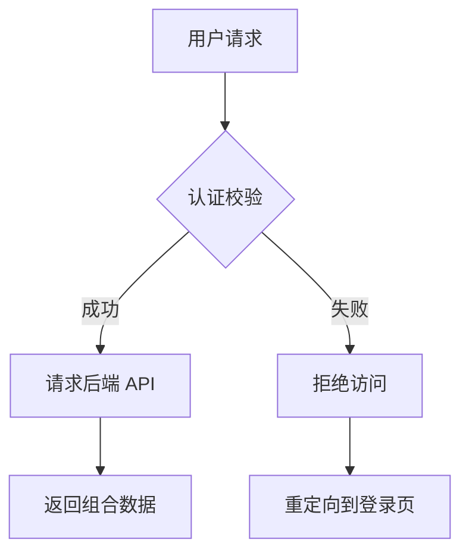

这篇文章展示了 Jekyll（基于 kramdown 解析器）所支持的绝大多数 markup 语法，用于测试主题样式或作为撰写文章的参考规范。

## 1. 基础排版 (Text Formatting)

这是普通的段落文本。你可以在段落中使用 **粗体文本**、*斜体文本*、***粗斜体***，或者删除线~~被划掉的内容~~。
还可以使用 `标记代码` (inline code)，或者添加脚注来补充说明[^1]。

通过 Kramdown 缩写扩展，你可以定义缩写，例如鼠标悬停在 HTML 上会显示全称。

*[HTML]: Hyper Text Markup Language

## 2. 标题层级 (Headings)

### 三级标题 (H3)

#### 四级标题 (H4)

##### 五级标题 (H5)

###### 六级标题 (H6)

> **技巧**：Jekyll 支持通过 `{: #custom-id}` 显式为标题自定义 ID。
{: #custom-heading-section}

## 3. 列表 (Lists)

### 无序列表

 * 顶级列表项 A
   * 二级列表项 A1
   * 二级列表项 A2
 * 顶级列表项 B
 * 顶级列表项 C

### 有序列表

 1. 第一步：准备 Jekyll 环境
 2. 第二步：编写 Markdown 文件
 3. 第三步：运行 `jekyll serve` 构建

### 任务列表 (Task Lists)

 * [x] 完成 Jekyll 配置文件设置
 * [x] 撰写示例 Markdown 文章
 * [ ] 部署到 GitHub Pages

## 4. 引用与块级元素 (Blockquotes)

> 这是一个单行块级引用 (Blockquote)。
> 
> > 这是一个嵌套的引用块。
> > 可以在这里提供出处或引申信息。

## 5. 代码高亮 (Code Blocks)

Jekyll 支持通过标准的 Markdown 语法高亮代码块。并且我们启用了 Rouge 的行号显示：

```javascript
// JavaScript 示例
function greet(name) {
    console.log(`Hello, ${name}! Welcome to Jekyll.`);
}

greet('Developer');
```

同时，Jekyll 原生支持 Liquid 的 `highlight` 标签：


# Python 示例
def calculate_factorial(n):
    if n == 0:
        return 1
    return n * calculate_factorial(n - 1)

print(f"Factorial of 5: {calculate_factorial(5)}")


## 6. 表格 (Tables)

这里展示了一个标准对齐方式的表格。

| 过滤器/属性 | 说明 | 示例输入 | 示例输出 |
|:---|:---|:---:|---:|
| `date_to_string` | 日期转为字符串 | `site.time` | 01 Aug 2026 |
| `upcase` | 字符转大写 | `"hello"` | HELLO |
| `size` | 获取数组或字符串长度 | `page.tags` | 4 |

## 7. 链接与媒体 (Links & Media)

 * [访问 Jekyll 官网](https://jekyllrb.com/){: target="_blank" rel="noopener"} *(含 Kramdown 扩展属性)*
 * [跳转到本文的特殊标题](#custom-heading-section) *(内部锚点)*

### 图片展示


*图：展示支持图片说明文本的效果*

## 8. Jekyll 特有扩展 (kramdown & Liquid)

### 属性列表 (Attribute Lists)

你可以直接给下一个元素添加 CSS 类名或内联样式：

这是一个带有自定义 CSS 类和背景样式的警告段落。
{: style="padding: 16px; border-left: 4px solid #f0ad4e; background: rgba(240, 173, 78, 0.1); border-radius: 4px;"}

### 定义列表 (Definition Lists)

Jekyll / Liquid
: 基于 Ruby 的静态网站生成器。

kramdown
: Jekyll 默认使用的 Markdown 解析引擎，支持丰富的扩展语法。
: 可以有多个解释。

### 数学公式 (LaTeX)

如果你的主题引入了 MathJax/KaTeX，可以渲染数学公式：

$$
E = mc^2
$$

### Liquid 变量调用示例

 * **本篇文章标题**：{{ page.title }}
 * **文章发布时间**：{{ page.date | date: "%Y年%m月%d日" }}
 * **标签数量**：{{ page.tags | size }} 个

## 9. GitHub Alerts (提示框)

我们通过自研的 AST 转换插件，原生支持了 GitHub 风格的 Alerts。在段落前加上 `> [!NOTE]` 等标记即可触发：

> [!NOTE]
> 这是一个 Note 提示框。用于强调一般性的补充信息。

> [!TIP]
> 这是一个 Tip 提示框。用于提供有用的建议或快捷方式。

> [!IMPORTANT]
> 这是一个 Important 提示框。用于向用户传达实现其目标必不可少的关键信息。

> [!WARNING]
> 这是一个 Warning 提示框。用于提醒用户注意潜在的风险。

> [!CAUTION]
> 这是一个 Caution 提示框。用于警告可能导致数据丢失或严重后果的高危操作。

## 10. 可折叠详情区 (Details & Summary)

你可以直接使用原生 HTML 的 `<details>` 和 `<summary>` 标签来包裹长文本或超长代码。我们已经为其适配了 MD3 风格的展开面板样式。

> [!TIP]
> 如果你想在 `<details>` 内部继续使用 Markdown 语法（如代码块、加粗等），必须在 `<details>` 标签上添加 `markdown="1"` 属性，并且在 `<summary>` 和内容之间**留一个空行**。

<details markdown="1">
<summary><b>点击展开查看详细构建日志</b></summary>

```bash
$ bundle exec jekyll build
Configuration file: /workspace/_config.yml
            Source: /workspace
       Destination: /workspace/_site
 Incremental build: disabled. Enable with --incremental
      Generating... 
       Jekyll Feed: Generating feed for posts
                    done in 0.548 seconds.
 Auto-regeneration: disabled. Use --watch to enable.
```

日志显示构建成功。
</details>

## 11. Mermaid 原生图表引擎

本博客内置了高性能、**按需懒加载 (Lazy Load)** 的 Mermaid 渲染支持。你只需要用标准的代码块并指定语言为 `mermaid` 即可绘制流程图、时序图、甘特图等。



## 12. 颜色色块自动预览 (Color Swatches)

在技术博客中，我们经常会讨论到颜色代码。现在，只要你在行内代码中写入规范的颜色值，系统就会自动在旁边生成一个 MD3 风格的圆形色块进行预览。

支持 HEX、RGB(A) 和 HSL(A) 格式：

* 主色调使用 `#FF5733` 或 `#0061A4`
* 也可以带透明度，比如 `#0061A480`
* 或者使用 `rgb(52, 152, 219)` 和 `rgba(52, 152, 219, 0.5)`
* HSL 同样支持：`hsl(120, 100%, 25%)`

## 13. STL 3D 模型原生渲染

现在你可以直接在博客中预览 3D 模型了。只需将 STL 数据包裹在 ````stl` 代码块中，前端的三维引擎会自动将其渲染为可通过鼠标拖拽旋转、支持物理光照材质的三维模型，完美契合 MD3 质感。

```stl
solid cube
  facet normal 0 0 -1
    outer loop
      vertex 0 0 0
      vertex 1 0 0
      vertex 1 1 0
    endloop
  endfacet
  facet normal 0 0 -1
    outer loop
      vertex 0 0 0
      vertex 1 1 0
      vertex 0 1 0
    endloop
  endfacet
endsolid
```

## 14. GeoJSON 交互式地图

同样地，地图数据也能原生渲染！只需要使用 ````geojson` 或 ````topojson`。系统会懒加载 Leaflet 地图组件，将坐标系精确绘制在全球地图上（使用 CartoDB 极简风格底图），并自动计算最佳缩放视角。

```geojson
{
  "type": "FeatureCollection",
  "features": [
    {
      "type": "Feature",
      "geometry": {
        "type": "Polygon",
        "coordinates": [
          [
            [116.38, 39.90],
            [116.42, 39.90],
            [116.42, 39.93],
            [116.38, 39.93],
            [116.38, 39.90]
          ]
        ]
      },
      "properties": {
        "name": "北京故宫区域示意"
      }
    }
  ]
}
```

## 15. 键盘按键风格渲染 (Keyboard Input)

在编写技术文档、快捷键说明时，你可以使用原生 `<kbd>` 标签。我们为其量身定制了微立体质感的物理键帽样式，这让快捷键的指引在视觉上更加清晰且极具质感。

* 快速打开命令面板：<kbd>Ctrl</kbd> + <kbd>Shift</kbd> + <kbd>P</kbd>
* 保存文件并退出：<kbd>⌘</kbd> + <kbd>S</kbd> 然后按 <kbd>Esc</kbd>
* 在终端中止当前进程：<kbd>Ctrl</kbd> + <kbd>C</kbd>

## 16. 文件下载卡片 (File Download Card)

如果你需要提供 Cloudflare R2 或者其他云存储的外部文件下载链接，不要使用干瘪的普通超链接。Jekyll 原生支持 Liquid `include` 标签，我们为你定制了一个 MD3 风格的下载展示 UI。

你只需要在文章中插入：
```liquid

```

**实际渲染效果：**





## 17. 媒体相册与全屏灯箱 (MD3 Gallery & Lightbox)

在撰写博客时，经常需要展示多张照片、截图或是演示视频。为了提供最优雅的浏览体验，本博客最新引入了 **自动相册 (Smart Gallery)** 与 **全屏悬浮灯箱 (MD3 Lightbox Viewer)** 功能。

### 自动组合的智能相册 (Smart Gallery)

你不需要在 Markdown 中书写任何复杂的 HTML 代码。**只要你将多张图片连续放置（即换行连续写 ``，且中间不穿插其他文本），底层的引擎就会在页面加载时，自动识别并将它们打包成一个高级相册组件。**

生成的相册具有以下特性：
- **上大图、下缩略图**：采用现代化的 `16:9` 黄金比例展示主视图，下方提供可横向滑动的缩略图列表。
- **无缝切换动画**：点击下方缩略图时，主视图会执行流畅的淡入淡出（Crossfade）切换动画，避免生硬的画面闪烁。
- **MD3 设计语言**：选中的缩略图会有一圈柔和的强调色边框（Primary Color），并且带有细微的不透明度渐变反馈。

下面是一个由 5 张高清风景图组成的相册示例，你可以点击下方的小图进行切换：


### 全屏沉浸式灯箱查看器 (Lightbox Viewer)

不仅相册里的大图可以点击，即便是文章中单独出现的一张图片，当你点击它时，都会立即唤出一个沉浸式的全屏灯箱。

> [!TIP]
> **操作指南**：
> 1. **缩放**：在全屏状态下，你可以直接使用鼠标滚轮进行无级缩放。或者点击右上角的 🔍 放大/缩小按钮。
> 2. **拖拽平移**：当图片被放大后，你可以按住鼠标左键（或在手机上使用手指）随意拖动图片，查看细节。
> 3. **快捷键切换**：如果你是在相册中打开了灯箱，可以使用键盘上的 `←` 左箭头 和 `→` 右箭头 快速翻页。
> 4. **退出**：点击右上角的关闭按钮、点击背景黑色模糊区域，或者直接按下键盘上的 <kbd>Esc</kbd> 键即可退出全屏。

为了展示这个效果，这里有一张孤立的超高清宽幅照片，点击它感受一下毛玻璃背景（Backdrop Blur）衬托下的极致阅图体验吧：


---

[^1]: 这里是脚注的具体内容说明，Kramdown 会自动将其放在页面底部并生成双向跳转链接。
