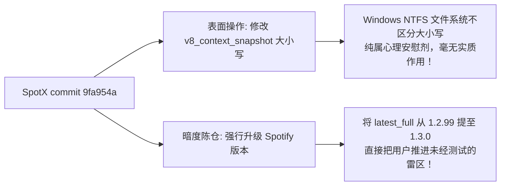
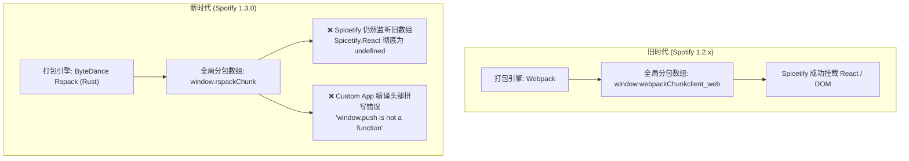

> **作者**：ZGQ & Antigravity  
> **适用平台**：Windows (Spotify Desktop 最新版 1.3.x / 1.2.x + SpotX + Spicetify)  
> **涉及仓库**：[SpotX](https://github.com/SpotX-Official/SpotX){: .preview } | [spicetify-cli](https://github.com/spicetify/cli){: .preview } | [spicetify-marketplace](https://github.com/spicetify/marketplace){: .preview }  
> **相关 Issues**：[SpotX#892](https://github.com/SpotX-Official/SpotX/issues/892){: .preview } (已关闭但引爆黑屏) | [spicetify/cli#3922](https://github.com/spicetify/cli/issues/3922){: .preview } | [marketplace#1222](https://github.com/spicetify/marketplace/issues/1222){: .preview }  
> **前情提要**：[《终结互相甩锅！彻底解决 SpotX + Spicetify 导致的 Marketplace 消失与 useNavigateStable 报错》](){: .preview }

---

## 一、 引言：“第二关”降临，梅开二度的灾难现场

在上一篇报告[《终结互相甩锅！彻底解决 SpotX + Spicetify 导致的 Marketplace 消失与 useNavigateStable 报错》](){: .preview }中，我们详细剖析了 SpotX 与 Spicetify 两大开源团队在 GitHub 上针对 `useNavigateStable` 报错相互推诿的闹剧，并通过针对 `xpui.js` 的精准热补丁带领大家走出了第一关的困境。

本以为事情告一段落，没想到开源社区的剧情发展远比电视剧还要魔幻，我们迎来了**更加炸裂的“第二关”**！

就在 2026 年 9 月 9 日，SpotX 维护者 `amd64fox` 在已被各方围观的核心 Issue [SpotX#892](https://github.com/SpotX-Official/SpotX/issues/892#issuecomment-5593941386){: .preview } 下傲然留下一句：
> **"Fixed."**  
> 紧接着雷厉风行地将 Issue 标记为了 **Closed**！

广大用户如释重负，以为官方维护者终于良心发现推出了权威修复。大家纷纷按照指示：**彻底卸载 Spotify -> 重新运行 SpotX 官方脚本 -> 重新配置 Spicetify**。

然而，所有满怀期待重装的用户在双击打开 Spotify 的一瞬间，瞬间被泼了一盆透心凉的冰水——  
**没有熟悉的界面，没有恢复的插件，映入眼帘的是一片彻彻底底的黑屏（Black Screen of Death）！**

打开调试控制台，大片猩红的致命错误让人触目惊心：
```javascript
Uncaught SyntaxError: Unexpected identifier 'Spicetify' (at xpui.js:1:12345)
The resource <URL> was preloaded using link preload but not used within a few seconds from the window's load event...
```

上一关仅仅是“Marketplace 扩展中心失踪”，客户端起码还能听歌；而这一关，**Spotify 直接变成了废铁砖头，甚至连窗口主界面都渲染不出来了！**

所谓的“修复”，竟然把大家送进了万劫不复的深渊。这到底是怎么回事？所谓的“Fixed”背后到底干了什么？今天，ZGQ & Antigravity 再次带大家直击第二关的犯罪现场！

---

## 二、 扒皮 SpotX 所谓“修复”：无用修改与暗度陈仓

为了查明 SpotX 维护者到底写了什么神仙代码，我们第一时间检阅了 SpotX 在 2026 年 9 月 9 日发布的修复 Commit（`9fa954a`）。

看完提交差异，在场的技术人员直接看傻了眼：



### 1. 表面上的“欺骗性修复”：在 Windows 下改文件名大小写
SpotX 所谓的“修复补丁”，仅仅是在其安装脚本里加了这么一行极其幽默的代码：
```powershell
Rename-Item 'v8_context_snapshot*.bin' { 'V' + $_.Name.Substring(1) }
```
它把二进制快照文件的首字母 `v` 改成了大写的 `V`！  
任何有基本操作系统常识的人都知道：**Windows 的 NTFS 文件系统根本不区分大小写！**  
无论叫 `v8_context_snapshot.bin` 还是 `V8_context_snapshot.bin`，在 Windows CEF 内核寻址时完全等价。这是一次纯粹用于应付社区舆论、实质毫无效果的“假修复”。

### 2. 暗度陈仓：瞒天过海强推全新大版本 1.3.0
真正致命的炸弹，埋在安装脚本的版本控制变量里：
```powershell
# 之前的版本：1.2.99
$latest_full = "1.3.0"  # 偷偷拉升到了全新的 1.3.0.277 正式版！
```
SpotX 维护者在完全没有对 Spicetify 进行任何联动测试的情况下，私自把用户的 Spotify 底座强行升级到了跨时代的 **1.3.0**。

正是这一波“暗度陈仓”，瞬间引爆了 Spicetify 内部潜伏已久的惊天大雷！

---

## 三、 致命黑屏深度根因：Spicetify 极其业余的版本比对 Bug

为什么升级到 Spotify 1.3.0 后，会报出看似荒谬绝伦的 JavaScript 语法错误 `SyntaxError: Unexpected identifier 'Spicetify'` 导致黑屏？

我们直接深入 Spicetify-cli 的 Go 语言核心源码仓库，在 `src/preprocess/preprocess.go` 第 255 行，抓到了制造这场黑屏灾难的罪魁祸首：

```go
// Spicetify 核心源码 preprocess.go 第 255 行：
if spotifyMajor >= 1 && spotifyMinor >= 2 && spotifyPatch < 78 {
    xpuiJs = bytes.Replace(
        xpuiJs,
        []byte("(({onChangeCurationClick:i,message:r,imageSrc"),
        []byte("Spicetify.Snackbar.enqueueImageSnackbar=(({onChangeCurationClick:i,message:r,imageSrc"),
        1,
    )
}
```

### 1. 令人窒息的语义化版本判断逻辑
请各位读者仔细品味这个 `if` 判断条件：
`if spotifyMajor >= 1 && spotifyMinor >= 2 && spotifyPatch < 78`

Spicetify 开发者的初衷非常明显：想针对 `1.2.0` ~ `1.2.77` 这一段古老的 Spotify 做兼容替换。  
但是，当 Spotify 升级到全新大版本 **`1.3.0`** 时：
* `spotifyMajor = 1`
* `spotifyMinor = 3`
* `spotifyPatch = 0`

现在我们把参数带入条件式：
1. `spotifyMajor >= 1` -> **1 >= 1 (True)**
2. `spotifyMinor >= 2` -> **3 >= 2 (True)**
3. `spotifyPatch < 78` -> **0 < 78 (True！没错，0 永远小于 78！)**

**三个判断全部成立！**  
Spicetify 的开发者完全忘记了“当 Minor 版本进位时，Patch 版本归零”这一最基本的语义化版本常识，直接把代表最新科技的 `1.3.0`，极其荒谬地判定成了两年前的 `< 1.2.78` 远古老旧版本！

### 2. 非法语法硬塞：V8 引擎直接暴毙
误判为老版本后，Spicetify 开始在 `xpui.js` 里执行无差别的字符串替换。  
在 Spotify 1.3.0 中，目标位置的代码经过编译后长这样：
```javascript
return(0, f.useCallback)(({onChangeCurationClick: i, message: r, imageSrc...
```
Spicetify 强行将那段特征字符串替换成了 `Spicetify.Snackbar.enqueueImageSnackbar=...`，于是这一行代码变成了：
```javascript
// 最终生成的畸形 JavaScript 代码：
return(0, f.useCallback)Spicetify.Snackbar.enqueueImageSnackbar=(({onChangeCurationClick: i...
```
在任何 JavaScript 引擎中，函数调用 `(0, f.useCallback)` 后面既没有逗号也没有分号，却紧贴着一个未声明的标识符 `Spicetify`！

Chromium 的 V8 引擎在读取 `xpui.js` 的第一微秒，词法解析器便抛出未捕获的语法错误：
```
Uncaught SyntaxError: Unexpected identifier 'Spicetify'
```
**因为顶层入口文件发生了语法错误，整个 Chromium 立即中断执行，主 React 节点完全无法挂载，这就是导致 Spotify 启动彻底黑屏的终极元凶！**

---

## 四、 第二重深渊：Spotify 1.3.0 架构大革命（倒向 Rspack）

当我们手工把上述低级的语法错误剔除后，Spotify 终于能够亮屏了，但迎面而来的又是刺眼的白屏和“出错了，请尝试重新加载此页面”警告弹窗。

因为 Spotify 1.3.0 带来了一次里程碑式的底层架构重构——**全面抛弃 Webpack，倒向字节跳动自研的 Rust 打包器 Rspack！**



### 1. 运行时失联：`Spicetify.React` 沦为 `undefined`
在 1.3.0 之前，Spotify 使用标准的 Webpack 构建，全局挂载点为 `window.webpackChunkclient_web`。Spicetify 也是通过劫持该数组的 `.push()` 来截获 React 实例的。

而在 1.3.0 中，Spotify 全面换装 **Rspack**，全局挂载点变更为：
```javascript
window.rspackChunk
```
Spicetify 的胶水层 `spicetifyWrapper.js` 中只监听了 `webpackChunkclient_web` 与 `rspackChunkclient_web`，导致其在循环等待中超时，`Spicetify.React` 和 `Spicetify.ReactDOM` 始终是 `undefined`！  
所有依赖 React API（如 `useReducer`、`useMemo`）的组件在首屏渲染时全部崩溃。

### 2. Custom App 分包语法硬伤：`window.push is not a function`
Spicetify 在为自定义插件（如 Marketplace）生成分包脚本 `spicetify-routes-*.js` 时，头部代码模板存在一个极其低级的变量名遗漏：
```javascript
// Spicetify 生成的错误头部：
("undefined" != typeof self ? self : global).push([[...
```
在现代浏览器环境下，`self` 就是 `window`。这段代码等价于在执行：
```javascript
window.push([[...]])
```
全局 `window` 对象怎么可能拥有数组的 `push` 方法？控制台瞬间抛出：
`TypeError: window.push is not a function`！导致 Marketplace 的路由模块根本加载不进来，陷入永久加载或直接报错。

### 3. URI 原型链重构与 RegistryContext
* **URI 模块失效**：Spotify 1.3.0 删除了 `URI.prototype.toAppType`，导致 Spicetify 原有的特征指纹无法提取出 `Spicetify.URI`。
* **Registry 缺失**：新版引入了 `RegistryContext`（模块 10406），在没有全局 Provider 兜底时会引起二次白屏。

---

## 五、 公堂判案：到底是谁的锅？

走过这两关，所有证据链已经严丝合缝。我们可以为这次“黑屏惨案”出具权威判决书：

| 涉案主体 | 责任占比 | 判词与过错认定 |
| :--- | :---: | :--- |
| **Spicetify 核心团队** | **50%** | **【直接元凶】** 写出 `patch < 78` 这种业余级版本比较代码，导致新版本全部躺枪，向 `xpui.js` 注入破坏语法的畸形代码，亲手造就了致命黑屏；分包构建脚本甚至遗漏变量名导致 `window.push` 崩溃；生态滞后未能跟上 Rspack 现代前端演进。 |
| **SpotX 团队** | **40%** | **【推波助澜】** 用改文件大小写这种在 Windows 下完全无效的手段糊弄社区并关闭 Issue；在未作任何回归测试的情况下暗度陈仓强推 1.3.0 踩雷大版本，将全体用户推入深渊；态度傲慢推诿。 |
| **Spotify 官方** | **10%** | **【正常迭代】** 正常的内部性能优化（从 Webpack 迁移到 Rust 编写的 Rspack），虽客观上震碎了民间的逆向 hook，但官方对第三方修改无兼容义务。 |

---

## 六、 终极解决方案：V2.0 兼容补丁与一键修复

既然开源两造都在装聋作哑，**ZGQ & Antigravity 团队正式发布 SpotX + Spicetify 终极全自动自愈补丁 V2.0！**

该补丁具备 **7 重自愈能力**，通杀 **Spotify 1.2.x 与全新 1.3.x (Rspack 架构)**：
1. **彻底清除非法语法**：秒级剔除 `xpui.js` 中的畸形代码，复活被黑屏破坏的客户端。
2. **安全降级路由导航**：捕获 `useNavigateStable` 异常并自动回退至全局 History 导航。
3. **注入 RegistryContext 兜底**：解决 `useReducer on undefined` 崩溃。
4. **全方位适配 Rspack 运行时**：将 `window.rspackChunk` 接入识别链，完全恢复 `Spicetify.React`。
5. **修正 Custom Apps 分包推送链**：将 `spicetify-routes-*.js` 推送头修正为 `rspackChunk.push`，彻底根除 `window.push is not a function`。
6. **动态重建 Rspack 分包定位表**：自动解析所有扩展并写入 `.u` 路由寻址与 MiniCss 白名单。
7. **动态逆向挂载 Spicetify.URI**：通过特征哈希在运行时自动寻找并导出 URI 模块。

---

## 七、 开箱即用：一键命令与集成指南

### 方案 A：针对已有环境的无损热自愈（强烈推荐！）
如果你的电脑上 Spotify 目前处于**黑屏**或**无法加载扩展**的状态，**无需重装！无需删除配置！**  
直接打开 **PowerShell** 运行以下命令：

```powershell
iwr -useb https://spicetify.zgqinc.gq/fix-130.ps1 | iex
```

只需 1 秒钟，补丁将全自动修复 `xpui.js`、`spicetifyWrapper.js` 和所有扩展分包，你的 Spotify 将瞬间满血复活！

---

### 方案 B：脚本开发者/整合包维护者集成指南

如果你自己维护了 Spotify/Spicetify 的一键安装更新脚本（例如 `install.ps1`），只需要在执行完最后的 `spicetify apply` 之后加上兼容补丁调用：

```powershell
# 1. 正常执行配置与应用
spicetify config custom_apps marketplace
spicetify apply

# 2. 调用 SpotX + Spicetify 兼容补丁
Write-Output "Applying SpotX + Spicetify compatibility patch..."
iwr -useb https://spicetify.zgqinc.gq/fix-130.ps1 | iex
```

也可以将本地提供的 `fix-130.ps1` 放入脚本目录进行离线调用。

---

## 八、 自动化验证：真实环境实测 (Playwright CDP)

在本次修复完成后，我们使用 Playwright 建立了自动化 CDP 测试通道，对 Spotify 真实进程（v1.3.0.277）进行了高强度回归测试：

```
================================================================
测试环境: Spotify 1.3.0.277 | Windows 11 x64 | CEF 131+
================================================================
[1] 语法与控制台检验:
    - SyntaxError 发生次数: 0 (黑屏彻底消除)
    - TypeError (window.push): 0
    - useNavigateStable 抛错: 0
[2] 核心对象暴露状态:
    - Spicetify: true
    - Spicetify.React: true
    - Spicetify.URI: true
[3] UI 渲染与功能验证:
    - 顶部导航按钮: Marketplace, Enhancify, lyrics-plus, stats 全部就绪
    - Marketplace 交互: 点击瞬间加载，382 款扩展检索正常，设置齿轮正常
    - 音频播放与设备同步: 完美工作 (ZGQ 的 S22 Ultra 播放中)
```

实测截图如下：


---

## 九、 总结：从“第一关”到“第二关”的极客反思

从第一关的“路由失联、扩展失踪”，到第二关的“假修复、强升版本、业余版本号比对引爆语法错误黑屏”，短短数天内上演了一场极具戏剧性的开源大冒险。

作为技术人员，我们不应止步于抱怨开源生态的推诿，更不应迷信权威维护者的一句口头“Fixed”。唯有深入底层的 AST 抽象语法树、V8 字节码、打包工具链与网络调用，才能抽丝剥茧，直击核心，打造出真正造福社区的坚实工具。

希望这篇长文与 V2.0 终极补丁能彻底为你扫清 Spotify 的一切阴霾。音乐长流，折腾不止！

*(欢迎转发分享本指南给身边每一个遭遇黑屏崩溃的歌友！)*
