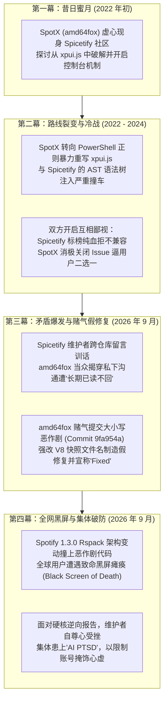

> **作者**：ZGQ & Antigravity  
> **系列导航**：  
> * 第一篇：[《终结互相甩锅！彻底解决 SpotX + Spicetify 导致的 Marketplace 消失与 useNavigateStable 报错》](){: .preview }  
> * 第二篇：[《梅开二度！SpotX 假修复引发 1.3.0 致命黑屏，揭秘 Spicetify 业余 Bug 与 Rspack 大崩盘》](){: .preview }  
> * 第三篇：**本文（四年恩怨录深度复盘）**

在上一篇排查报告[《SpotX 假修复与 1.3.0 致命黑屏：一次赌气提交引发的灾难》](){: .preview }中，我们通过细致的字节码与抽象语法树（AST）逆向，还原了 Spotify 客户端升级至 1.3.0 后 Marketplace 丢失、界面白屏与崩溃的技术根因。

然而，不少读者在看完全文后都在追问同一个问题：
> **“为什么一个广受欢迎的去广告脚本和一个老牌的美化框架，在协同工作时会如此灾难？既然只要稍微调整一下脚本逻辑就能完美共存，为什么两边的官方仓库宁可互相推诿几年，也不愿意做哪怕一行兼容适配？”**

带着这个疑问，我们深挖了 GitHub 上两座仓库近四年来的 Issues、PR 以及维护者的讨论轨迹。结果令人啼笑皆非——**这根本不是单纯的技术兼容难题，而是一部交织着“技术路线互斥”、“社区傲慢鄙视”、“维护者已读不回”，最后演变成“赌气式负面修复”的开源人间喜剧。**

今天，我们就来扒一扒 SpotX 与 Spicetify 之间鲜为人知的恩怨始末。

---

## 第一幕：昔日蜜月——2022 年初的虚心请教

把时间倒回 **2022 年初**。在那个时期，SpotX 和 Spicetify 的生态位是非常分明的：
- **SpotX**：脱胎于 BlockTheSpot，主打轻量化的 PowerShell/Batch 自动化安装，通过修改 hosts 和加载 DLL 来屏蔽 Spotify 广告；
- **Spicetify**：专注于客户端深度美化、CSS 主题注入和 JavaScript 插件扩展框架。

两边井水不犯河水，各自安好。

甚至在 **2022 年 3 月** 的 Spicetify 官方仓库讨论帖 [spicetify/cli #1518](https://github.com/spicetify/cli/issues/1518){: .preview }（关于 Spotify 官方更新屏蔽 DevTools 开发者工具）中，SpotX 的作者 `@amd64fox` 还曾现身 Spicetify 社区，积极地与 Spicetify 的核心成员探讨如何从 `xpui.js` 中破解并开启控制台。

彼时的 `amd64fox` 在回复中态度非常谦逊客气：
> *@amd64fox (2022-03-12)*:  
> *"If this option is enabled, `app.enable-developer-mode=true` line is added to the prefs file, but the developer tools still don't work. **I'm not good with JS, maybe this can be fixed.**"*  
> （如果开启了这个选项，prefs 会写入配置，但开发者工具还是打不开。我对 JS 不太在行，也许这能被修好。）

那时候没有人能预料到，四年后两人会在 Issue 区演变成近乎撕破脸皮的公开争吵。

---

## 第二幕：路线裂变——暴力正则撞上 AST 框架（2022 年底 ~ 2024 年）

转折点发生在 **2022 年秋季**。

从 SpotX v1.5 开始，`amd64fox` 不再满足于仅仅通过外部 DLL 劫持流量，而是开始自研核心修补逻辑，**直接在 PowerShell 脚本中对 Spotify 核心打包文件 `xpui.js` 进行粗暴的正则匹配与代码重写**。

正是这一步，彻底点燃了两大项目的“八字不合”：
- **Spicetify 的技术信仰**：Spicetify 是一个用 Go 编写、极为严密的客户端修改引擎，它依赖解析 bundle 中的语法树、定位特定全局钩子，并有序注入 `Spicetify` 全局对象。
- **SpotX 的野蛮生长**：SpotX 的处理方式非常直接，直接硬编码正则砍掉大段代码、强行改写加载入口。

一旦用户同时运行这两个工具，SpotX 改动过的语法结构就会让 Spicetify 的正则找不到锚点；反之，Spicetify 打过的补丁又会被 SpotX 当作“未知损坏”强行抹掉。

伴随着代码的互撞，两边官方团队的态度开始急转直下，形成了长达数年的“互相鄙视链”：

### 1. Spicetify 团队的高傲与“纯血优越感”
面对频繁前来求助“为什么装了 SpotX 之后主题挂了”的普通用户，Spicetify 团队逐渐失去了耐心，开始在各种 Issue 中明确表达对 SpotX 的反感：
* 在 [#1939](https://github.com/spicetify/cli/issues/1939){: .preview } 中，Spicetify 维护者冷淡表态：
  > *"Compatibility with another client modifier has never been our priority."*  
  > （兼容其他客户端修改器从来不是我们的优先级。）
* 在 [#2861](https://github.com/spicetify/cli/issues/2861){: .preview } 中，Spicetify 成员更是直言不讳地开嘲讽：
  > *"We do not support or encourage using spotX with spicetify as they modify xpui in a contradictory manner. Use one or the other and **keep in mind spicetify is capable of everything spotX is, you do not need both.**"*  
  > （我们不支持也不鼓励同时使用 SpotX 和 Spicetify。请二选一，**记住 Spicetify 具备 SpotX 的全部功能，你根本不需要 SpotX。**）

### 2. SpotX 作者的消极怠工与一刀切
而在 SpotX 这边，`amd64fox` 同样感到厌烦。只要用户在 Issue 模板中勾选了“已安装 Spicetify”：
* 用户反映某些小组件不见了（如 [#567](https://github.com/SpotX-Official/SpotX/issues/567){: .preview }），作者只回一句冷冰冰的 `"not reproducible"` 并直接关闭；
* 用户询问更新时能否不要强行阻断 Spicetify（如 [#407](https://github.com/SpotX-Official/SpotX/issues/407){: .preview }、[#762](https://github.com/SpotX-Official/SpotX/issues/762){: .preview }），作者统一丢出自己的卸载脚本：“先全部卸载，重装原版，再跑我的脚本，别问。”

**两边形成了长达三年的死结：Spicetify 觉得 SpotX 是外行乱搞的垃圾脚本，SpotX 觉得 Spicetify 屁事多且爱甩锅。普通用户夹在中间，成了最无辜的皮球。**

---

## 第三幕：私怨爆发——已读不回、当众掀桌与赌气式假修复（2026 年 9 月）

这场旷日持久的冷战，终于在 **2026 年 9 月初**迎来了核爆级的公开爆发。

### 1. 踢皮球与“空降查岗”
9 月 7 日，用户 `@UmairAhmed406` 详细分析了为什么混用会导致 Marketplace 丢失，并在 Spicetify 提了 [#3922](https://github.com/spicetify/cli/issues/3922){: .preview }。
Spicetify 核心成员 `@rxri` 毫不客气地秒关 Issue，并留下了标志性的甩锅金句：
> `@rxri`: *"This is SpotX's fault, not ours. SpotX is aware of this, but as far as I know, no fix is planned. Both should not be used at the same time."*  
> （这是 SpotX 的错，不是我们的。SpotX 知道这事，但据我所知他们不打算修。两者不应该同时使用。）

用户转头把这话贴回了 SpotX 的仓库 [#892](https://github.com/SpotX-Official/SpotX/issues/892){: .preview }。令人意想不到的是，**`rxri` 竟然直接“追杀”到了 SpotX 的仓库下方，当着全体用户的面留言训话**：
> `@rxri`: *"I and @amd64fox were already talking about this. We always tell people not to use SpotX & spicetify at the same time... Also, using AI to write the reply and these posts was not needed at all."*  
> （我和 @amd64fox 早就私下聊过这事了。我们一直都在告诉大家不要同时用两者……另外，根本没必要用 AI 来发帖和回复。）

### 2. 当场打脸：自尊心崩溃后的公开对质
`rxri` 大概以为这番“维护者达成了共识”的表态能堵住用户的嘴。但他没想到，这直接点燃了 `amd64fox` 的滔天怒火！

几个小时后，`amd64fox` 在全世界面前毫不留情地揭穿了 `rxri` 的谎言，爆出了开源社区名场面：
> `@amd64fox (2026-09-07)`:  
> *"for spotx this isn't a bug, it's just logic that makes working with patches a bit easier.*  
> ***i suggested to riri that i could fix it, but she never responded.***"*  
> （对 SpotX 来说这根本不是 bug，只是为了让补丁工作更方便的逻辑。**我之前主动向 riri 提议过我可以解决这个问题，但她从来就没回复过我！**）

**这一句话，直接撕碎了所谓的“官方默契”！**
原来私下里，SpotX 作者曾试图放下身段找 Spicetify 沟通协作，结果换来的却是高高在上的“已读不回”与彻底无视。

### 3. 小人招数：赌气式的“假修复”
被无视并当众说穿的羞辱感，让 `amd64fox` 作出了极不理智的报复性决策。

既然你 Spicetify 不理我，还口口声声说是我破坏了你的文件——那我就用最恶心的方式“修”给你看！
9 月 8 日，`amd64fox` 单方面推送了那个著名的 Commit [`9fa954a`](https://github.com/SpotX-Official/SpotX/commit/9fa954ac63ae12423ef8168285511ba90b9bce22){: .preview }（提交说明为 `- skip snapshot creation in spicetify #892`）。

他是怎么“修复”的呢？
他在脚本里加了一行：**把系统里的 `v8_context_snapshot.bin` 强行改名为首字母大写的 `V8_context_snapshot.bin`！**
由于 Windows 默认不区分大小写，Spotify 客户端能正常读取；但 Spicetify 的 Go 源码里写死了严格区分大小写的字符串比对——Spicetify 找不到小写的 `v8`，就会误以为当前环境没有 Snapshot，从而跳过对 `xpui-modules.js` 的改写！

搞完这个令人喷饭的恶作剧把戏后，`amd64fox` 极其高傲地在 Issue #892 下留下两个字母并强行关贴：
> **"fixed"**

---

## 第四幕：狂欢崩塌——全网黑屏与集体患上的“AI PTSD”

`amd64fox` 以为自己耍了个绝顶聪明的小聪明，既能在社区里宣布“SpotX 完美修复了”，又能暗中让 Spicetify 吃个哑巴亏。顺带手，他还得意洋洋地把 Spotify 强制拉升到了最新版 **1.3.0**。

但他根本没有做过任何严格的端到端测试。

### 1. 致命翻车与遮羞布被扯烂
现实毫不留情地给了他一记响亮的耳光。
在 Spotify 1.3.0 中，底层打包工具换成了 Rspack，原本的模块机制发生剧变。这个大小写把戏不仅彻底摧毁了 Spicetify 的运行前置条件，还引发了一连串致命的链式崩溃：
- Spicetify 把全局对象错误注入到死代码中；
- 运行时报出致命异常：`Uncaught SyntaxError: Unexpected identifier 'Spicetify'`；
- **全球无数盲目跟进更新的普通用户，只要双击 Spotify，迎面而来的就是一个彻彻底底的黑屏死机！**

笔者在发现问题后，立刻进行了逆向拆解，定位出全部技术链路并提供了完备的兼容注入方案，提交至 Issue [#894](https://github.com/SpotX-Official/SpotX/issues/894){: .preview }。

这份带有时序分析、AST 对应行号和十六进制证据的报告，把 `amd64fox` 的“赌气假修复”底裤扒得一干二净。

### 2. 气急败坏：威胁封禁与“AI 创伤后应激障碍”
面对无可辩驳的技术证据，`amd64fox` 的自尊心彻底破碎了。他没有反驳任何一条技术论据，而是恼羞成怒地把 Issue 改成了 `off-topic`（跑题），并留下了威胁：
> `@amd64fox`:  
> *"has nothing to do with spotx, also no one's forcing u to install the latest version, u can choose any version u want.  
> **as for using ai in ur replies, at least in our repo, pls don't do it again or you'll be restricted.**"*  
> （这跟 SpotX 无关，也没人逼你装最新版。至于在回复里用 AI，至少在我们仓库，请别再这么干了，**否则你会被限制账号**。）

细心的读者此时一定会发现一个极其滑稽的共同特征：
- Spicetify 的 `rxri` 在 #892 训斥用户：*“using AI to write the reply and these posts was not needed at all”*；
- SpotX 的 `amd64fox` 在 #894 威胁用户：*“as for using ai in ur replies... pls don't do it again or you'll be restricted”*。

**为什么这两个互相看不顺眼的维护者，在面对 AI 辅助的深度技术分析时，表现出了惊人一致的“过敏反应（AI PTSD）”？**

原因其实很简单：
在以往，面对普通小白用户零散的报错，他们习惯了用一句“不是我们的锅”、“不支持”、“自行卸载”来打发，高高在上地维持着开源作者的权威人设；
但当用户结合 AI 的深度代码解构，把**汇编行号、AST 缺陷、逻辑死锁、甚至他自己提交的赌气代码**白纸黑字拍在他们脸上时，他们发现过去那一套敷衍话术彻底失灵了。

在技术声誉受到降维打击的恐慌中，“你用了 AI”成了他们掩饰心虚、给对方扣帽子、把技术严肃性降格为“垃圾信息违规”的最后一块遮羞布。

---

## 尾声：开源从来不该是任性私怨的试验场

开源软件之所以伟大，是因为它诞生于协作、包容与共识。

Spicetify 拥有极其优秀的模块化思想和繁荣的插件生态；SpotX 拥有极为便捷的本地化体验与去广告逻辑。两者本应相得益彰，成为全球数字音乐玩家手中最完美的听歌工具。

然而：
- 一边是自命不凡、对第三方修改器冷眼相看、对别人的示好“已读不回”的高傲维护者；
- 一边是自尊心受挫、不顾软件工程底线、靠耍小聪明和赌气代码搞出全网黑屏的开发者；
- 最终买单受害的，全都是在屏幕前无所适从、只想安安静静听歌的普通用户。

**技术的本质是解决问题，而不是制造对立；代码的归宿是服务用户，而不是发泄情绪。**

这场开源闹剧终究会成为过去，而那些经得起推敲的代码、不被傲慢裹挟的极客精神，以及真正能让 Spotify 完美运行的开源修复，才会被社区真正铭记。
