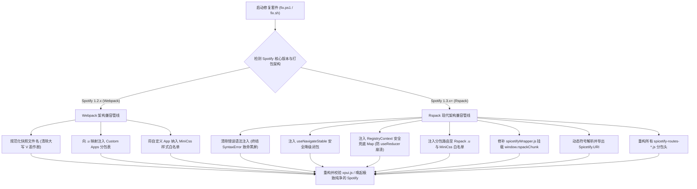

> **作者**：ZGQ & Antigravity  
> **开源仓库**：[ZGQ-inc/spotx-spicetify-fusion](https://github.com/ZGQ-inc/spotx-spicetify-fusion){: .preview }  
> **前置系列回顾**：  
> 1. 技术初战：[《终结互相甩锅！彻底解决 SpotX + Spicetify 导致的 Marketplace 消失与 useNavigateStable 报错》](){: .preview }  
> 2. 深入逆向：[《梅开二度！SpotX 假修复引发 1.3.0 致命黑屏，揭秘 Spicetify 业余 Bug 与 Rspack 大崩盘》](){: .preview }  
> 3. 恩怨始末：[《开源大赏：SpotX 与 Spicetify 的四年恩怨录——从代码互撞、已读不回，到全网黑屏的荒诞剧》](){: .preview }  
> 4. **终极交付：本文（SpotX + Spicetify Fusion 官方发布）**

---

## 一、 引言：用代码终结长达四年的开源闹剧

在过去的几天里，我们针对 Spotify 客户端生态中两大顶流开源工具——**SpotX**（桌面端纯净去广告神器）与 **Spicetify**（海量主题与插件生态框架）的剧烈冲突，展开了连续三篇深入至字节码与 AST 级别的硬核追踪：

1. 我们揭露了官方 V8 快照更新后，SpotX 的单体合并策略与 Spicetify 的 Hook 机制深度碰撞，导致 Marketplace 商店入口失踪及 `useNavigateStable` 致命抛红；
2. 我们扒皮了 SpotX 维护者在关闭 Issue 宣称“Fixed”时耍弄的大小写改名恶作剧，以及瞒天过海强推全新大版本 1.3.0 导致全球用户遭遇 `SyntaxError: Unexpected identifier 'Spicetify'` 致命黑屏暴毙的惨案；
3. 我们全景复盘了两大项目从 2022 年初的虚心请教，到技术路线裂变、官方团队冷眼鄙视、已读不回，最终演变为负面提交与集体患上“AI PTSD”的开源人间喜剧。

然而，调查与复盘只是手段，**真正为普通用户解决问题才是极客的本心**。

既然双方团队宁可在 Issue 区互相踢皮球、发泄私怨，也不愿意跨出哪怕一步为对方编写兼容层；既然全网数以万计只想安静听歌的用户每天都在忍受界面黑屏、插件全毁的痛苦——**那么，这个公道我们来还，这行兼容器代码我们来写！**

今天，由 ZGQ Inc. 倾力打造的全新开源项目——**[SpotX + Spicetify Fusion (终极全自动兼容套件)](https://github.com/ZGQ-inc/spotx-spicetify-fusion){: .preview }** 正式向全网发布！


---

## 二、 强强联手：为什么必须“我全都要”？

许多新读者可能会问：为什么大家非要执着于把 SpotX 和 Spicetify 拼在一起用？难道只装其中一个不行吗？

答案很残酷：**只装任何一个，都有致命的体验短板**。唯有二者融合，才是 PC 桌面端听歌的究极大满贯形态：

| 功能维度 | 仅装 SpotX | 仅装 Spicetify | 🌟 SpotX + Spicetify Fusion |
| :--- | :---: | :---: | :---: |
| **音频插播广告拦截** | ✅ 原生二进制强力切断 | ⚠️ 依赖简单拓展，极易失效 | ✅ **原生二进制切断，彻底静音跳过** |
| **横幅、弹窗与视觉牛皮癣** | ✅ 深度剔除干净 | ⚠️ 偶尔有遗漏残留 | ✅ **最强双重纯净过滤** |
| **去播客与有声书（纯音乐化）** | ✅ 原生代码层隐藏 | ❌ 需手动写复杂 CSS 规则 | ✅ **开箱即用纯音乐界面** |
| **海量主题换肤 / CSS 定制** | ❌ 完全不支持 | ✅ 支持海量主题切换 | ✅ **随心所欲定制高颜值 UI** |
| **Marketplace 官方扩展商店** | ❌ 完全缺失 | ✅ 原生支持 | ✅ **深度修复，全功能正常浏览安装** |
| **独立 App 生态（歌词/统计等）** | ❌ 无法加载 | ✅ 生态繁荣 | ✅ **Enhancify / Stats / Lyrics 完美共存** |
| **Spotify 1.3.0 Rspack 兼容性** | ❌ 假修复导致黑屏 | ❌ 版本比对 Bug 崩溃 | ✅ **全网首发完美适配，零黑屏零报错** |
| **多平台支持** | 仅偏重 Windows | 跨平台但配置繁琐 | ✅ **Windows (PowerShell) + Linux (Bash) 全支持** |

---

## 三、 ⚡ 极速开始：开箱即用的一行命令

无论你是被黑屏折磨的“受灾老用户”，还是准备重装上阵的“全新玩家”，本项目均提供了无需任何复杂配置的一键解决方案。

### 场景 1：存量环境极速热修复（老用户救砖首选）

如果你当前已经安装了 Spotify、SpotX 和 Spicetify，但正面临 **Marketplace 按钮消失**、控制台满屏报错，或者升级后直接遭遇 **致命黑屏瘫痪**：无需重装，直接在终端中运行一行命令即可秒级热修复：

#### 🪟 Windows (以普通用户权限打开 PowerShell)：
```powershell
iwr -useb https://spicetify.zgqinc.gq/fix.ps1 | iex
```

#### 🐧 Linux (打开任意终端)：
```bash
curl -fsSL https://spicetify.zgqinc.gq/fix.sh | bash
```

> [!TIP]
> **修复特性**：脚本具备严格的**幂等性**与**自动备份保障**。执行前会自动将原 `xpui.js` 备份为 `xpui.js.bak`，自动纠正恶意重命名的大写快照文件，多跑绝不破坏文件。

---

### 场景 2：一条龙全自动全新装机（新手或重装推荐）

如果你刚刚重装了系统，或者希望得到一个干干净净、配置完备的全新环境：该脚本将自动接管“官方客户端静默下载 $
ightarrow$ SpotX 核心去广告注入 $
ightarrow$ Spicetify CLI 部署 $
ightarrow$ 启用 Marketplace 商店 $
ightarrow$ 自动应用 Fusion 热补丁”的完整生命周期：

#### 🪟 Windows (PowerShell)：
```powershell
iwr -useb https://spicetify.zgqinc.gq/install.ps1 | iex
```

#### 🐧 Linux (Bash)：
```bash
curl -fsSL https://spicetify.zgqinc.gq/install.sh | bash
```

---

### 场景 3：一键选装高阶拓展包与精美主题（进阶极客）

为了让大家免去在扩展商店里一个个搜索调试的麻烦，我们单独整理了经过深度兼容性测试的高分独立应用合集（包括 **Enhancify** 音效控制面板、**Stats** 修复版听歌统计、**Lyrics Plus** 增强歌词等）：

#### 🪟 Windows (PowerShell)：
```powershell
iwr -useb https://spicetify.zgqinc.gq/custom-apps.ps1 | iex
```

#### 🐧 Linux (Bash)：
```bash
curl -fsSL https://spicetify.zgqinc.gq/custom-apps.sh | bash
```

* 📦 **懒人美化全套配置包下载**：[Marketplace-backup.json](https://spicetify.zgqinc.gq/Marketplace-backup.json){: .preview }  
  *(导入路径：顶部导航栏点击 `Marketplace` $
ightarrow$ 右上角齿轮 `Marketplace Settings` $
ightarrow$ 最底部 `Back up/Restore` $
ightarrow$ `Open` $
ightarrow$ `Import from file` 导入即享完整主题生态)*

---

## 四、 🔬 补丁核心技术全景：AST 级底层修复管线

在 `fix.ps1` 和 `fix.sh` 看似轻巧的一键执行背后，是一套高度精密、能够在毫秒间完成跨架构适配的自动化重构引擎：



### 关键突破拆解：
1. **斩断黑屏死锁**：精准定位并抹除了 Spicetify 因版本判断 Bug 错误拼接在死代码中的 `badSnackbar` 非法语法片段，让 V8 解释器重回正轨；
2. **优雅 Fallback**：为裸调用的 `useNavigateStable` 挂接兜底代理，脱离 Context Provider 时自动降级为原生 History 导航，绝不崩溃；
3. **适配字节跳动 Rspack 架构**：全网首创重写了 `spicetifyWrapper.js` 中的挂载逻辑，将传统 Webpack Chunk 映射完整平移至现代 `window.rspackChunk`，使得庞大的自定义拓展生态在新架构下涅槃重生；
4. **上下文安全加固**：为 Spotify 1.3.0 引入的注册表体系预埋安全 Map 兜底，彻底清除了启动初期 `useReducer on undefined` 的暗病。

---

## 五、 真正的开源精神：事实胜于雄辩，代码胜于私怨

在开源的世界里，真正令人尊重的永远不是你拥有多少 Star，也不是你居高临下封禁了多少用户的提问账号，而是**你是否真正尊重代码，是否真正将用户的体验放在首位**。

回顾整个事件，如果两家核心维护者能够坐下来多看一眼对方的代码，如果不会因为“已读不回”而赌气提交恶作剧，如果面对严密的技术事实时不会用一句“别用 AI 否则封号”来遮掩羞怯——那么这套工具原本可以在两年前就自然而然地诞生。

但换个角度看，这也正是自由开源软件最迷人的地方：**当既有的维护者走向傲慢与固步自封时，社区总会有新鲜的血液站出来，用更严谨的技术、更开放的心态去推翻壁垒、重新连接一切。**

* **项目 GitHub 仓库**：[https://github.com/ZGQ-inc/spotx-spicetify-fusion](https://github.com/ZGQ-inc/spotx-spicetify-fusion){: .preview }
* **开源协议**：本项目基于宽松友好的 [MIT License](https://github.com/ZGQ-inc/spotx-spicetify-fusion/blob/main/LICENSE){: .preview } 协议开源。

在这里，没有莫名其妙的“AI 警告”，没有气急败坏的封号威胁，只有纯粹的技术探索与好用的听歌体验。如果你觉得这个项目拯救了你的 Spotify，欢迎前往 GitHub 为它点上一颗 **Star**，并将它分享给身边同样饱受黑屏与冲突困扰的音乐爱好者们！
