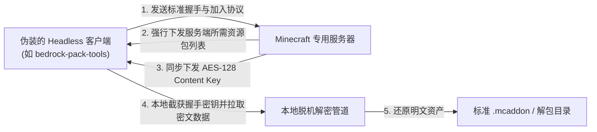

### 🎙️ 世纪破冰：村民的“哼哼哼”终于能听懂了！

如果你是一个经常刷外网 MC 社区的老玩家，那么对 Element Animation 打造的传奇恶搞系列动画——**《村民新闻》（Villager News）** 一定不会陌生。

在过去十几年里，Minecraft 里的村民无论发生什么大事，永远都只有一句高深莫测的“Hmmmm（哼~）”。玩家和他们交流全靠猜，交易全靠看脸。

而现在，**Minecraft 玩家和村民之间的语言障碍终于被彻底打通了！**

Mojang 官方市场近期正式上架了由 Oreville Studios 与 Element Animation 联合打造的正版官方扩展：**[Villager News 1.0 Add-On](https://www.minecraft.net/en-us/marketplace/pdp/oreville-studios/villager-news-1.0-add--on/9c7f8e8c-26e5-406a-b5d6-ac128d5678ac){: .preview }**。

在这个模组里，熟悉的直升机村民、手持简陋话筒的外景记者、戴着大框眼镜的演播室主播全员进驻你的生存世界。村民们不再只会呆滞地摇头晃脑，而是会用语速极快的无厘头播报吐槽你的每一次行动，甚至还会发生突发新闻现场采访，节目效果直接拉满！

* 🎬 **官方 YouTube 宣传片**：[点击前往观看预告片（YouTube）](https://youtube.com/watch?v=AWLJGHCaDpc){: .preview }

---

### 🈶 个人完整汉化版发布

由于官方商店上架的原版仅支持英语，里面的大量双关梗、村民吐槽和无厘头新闻台词如果啃生肉难免有些影响沉浸感。

觉得这个 Add-on 实在太有意思了，于是我花时间对整个模组的所有文本、事件提示、UI 界面及播报台词进行了**地毯式的个人简体中文汉化与本地化润色**，让各位朋友能在游戏里原汁原味地感受村民新闻的沙雕风味。

汉化整合包已封装为标准 `.mcaddon` 格式，支持 Windows 电脑端与手机移动端双击一键导入。

#### 📥 汉化成品高速直链下载：

{% include file_download.html
   name="Villager News 1.0 Add-On (Chinese).mcaddon"
   size="42.59 MB"
   date="2026-09-17"
   icon="sports_esports"
   url="https://assets.zgqinc.gq/Villager%20News%201.0%20Add-On%20(Chinese).mcaddon" %}

> [!TIP]
> **原版英文 Dump 备份存档**：  
> 如果你想收藏未修改的英文原版 Dump 存档，也可以通过原作者的临时网盘获取：  
> 🔗 [Gofile 英文原版 Dump 下载通道](https://gofile.io/d/jpggqkh0){: .preview }

---

### 🔬 极客硬核揭秘：付费 Marketplace 资源包是如何被脱机 Dump 的？

聊完模组本身，再来聊聊很多技术极客关心的底层话题：**为什么微软商店（Marketplace）里加密售卖的商业资源包能够被完整扒下来？**

在很多人的认知中，商业资产经过微软的加密打包后应当是固若金汤的。但经过深入研究 Minecraft 基岩版的网络同步协议后，极客们发现了一个天然的协议级“破绽”：

#### 核心解密原理剖析：
1. **多端同步机制**：在基岩版架构中，为了让加入服务器的所有玩家（无论他们是否在商城购买过该模组）都能看到完全一致的自定义模型、动作与材质，服务器会在握手阶段强制将世界加载的 Resource Pack 下发给客户端；
2. **密钥下发机制**：为了让合法连接的客户端能够实时渲染，服务器会在握手数据包中**直接随路下发该资源包的 AES 解密密钥（Content Key）**；
3. **伪装接入与捕获**：逆向开发者通过 Go 语言编写轻量级的虚拟客户端工具，模拟基岩版正常向服务器发起握手通信，在接收到加密资源流与 AES 密钥后，直接在本地利用密钥进行离线解密，瞬间将受保护的资产还原为结构透明、完全可读可编辑的标准资源包！

相关的逆向解密工具与庞大的基岩版市场已 Dump 资源归档频道，之前已经全面更新收录在我们的核心资源合集长文中：

👉 [《Minecraft (我的世界) 全域资源与底层逆向辅助大合集》](#🧱-第二维度高维材质包与硬核模组集散中心){: .preview }

---

### 🎮 安装与使用说明

1. **导入游戏**：
   * **Windows 平台**：下载完成 `.mcaddon` 后，直接鼠标双击文件，系统会自动唤起 Minecraft for Windows 并完成资源包与行为包的自动导入；
   * **Android / iOS**：在文件管理器中点击该文件，选择“使用 Minecraft 打开”即可。
2. **世界激活配置**：
   * 在新建世界或编辑现有存档时，进入左侧设置菜单：
   * 在 **【资源包 (Resource Packs)】** 中激活 `Villager News Add-On (中文版)`；
   * 在 **【行为包 (Behavior Packs)】** 中同样勾选激活；
   * 建议在世界设置中勾选开启【实验性玩法（Experiments）】相关的扩展接口，以获得最完整的无厘头新闻播报体验。

赶紧进游戏听听你的村民邻居们都在偷偷播报些什么重磅新闻吧！
