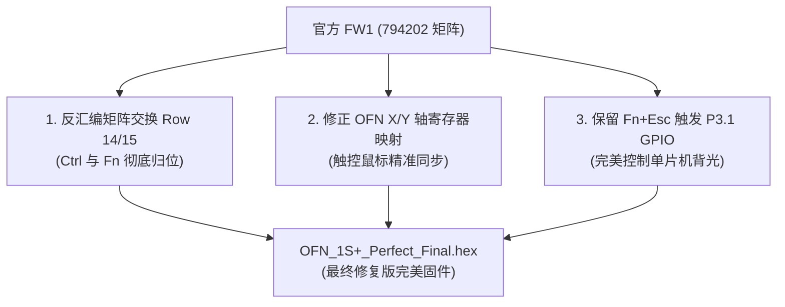

### 🎁 缘起：一份 800 元的生日礼物与对“小”的癫狂执迷

如果问我对于随身数码设备有什么近乎偏执的审美，那答案永远只有一个字——**小**。

我对极致小巧的计算设备有一种几乎算得上“癫狂”的执念。市面上很多所谓“便携电脑”，厚度和重量一加上去就瞬间失去了随身掏出来的欲望；而像 GPD Win Max 2 这样性能强劲的大号机型，虽然做工扎实，但 10.1 英寸的体量加上重量，背在身上依然存在感十足；至于 GPD Win Mini，手柄摇杆与厚重握把又让它们看起来更像是个游戏玩具，根本无法胜任我心目中那个随时随地开盖敲代码、排查服务器故障、编写脚本的随身 **Cyberdeck** 角色。

我不仅喜欢 GPD，也一直对**壹号本（One-Netbook）**情有独钟。前段时间在闲鱼上看到一台成色极佳的 **OneMix 1S+**，只要 799 元，对象就作为生日礼物送给了我。


*图：安静立在桌面上的 OneMix 1S+，小巧玲珑，运行着正向横屏的 KDE Plasma 现代桌面*

拿到手的那一刻，那种久违的、属于 2000 年代真正 UMPC 的工业机械美感扑面而来——纯银色阳极氧化全铝合金机身、极其紧凑的 7.0 英寸机身、支持 360 度翻转变形的铰链、手感扎实的物理键盘与正中间那颗散发着复古味道的光学指点杆（OFN）。

---

### 🔍 身世真相：披着一代羊皮的“二代缝合怪”

OneMix 1S+ 发布于 2020 年前后。如果单看名字里的“1S”，你很容易以为它只是初代 OneMix 1S（搭载赛扬 3965Y 或更早 Atom 处理器）的简单小改款。

但当你真正拆开机身、查看硬件信息时，就会发现壹号本官方在这个型号上玩了一出教科书级别的“硬件偷天换日”：**OneMix 1S+ 虽然外壳完全沿用了一代 1S 的紧凑模具，但主板硬件架构和核心处理器，实际上 100% 移植了二代（OneMix 2 / 2S）的成熟方案！**

| 核心组件 | OneMix 1S+ 物理规格 | 硬件识别码 / 拓扑特征 |
| :--- | :--- | :--- |
| **处理器 (CPU)** | **Intel Core m3-8100Y** (2核4线程, 3.4GHz 睿频, 14nm) | `Amber Lake-Y` 超低功耗架构 |
| **核心显卡 (GPU)** | Intel UHD Graphics 615 (24 EU) | 硬件硬解 4K VP9 / H.265 |
| **运行内存 (RAM)** | 8GB LPDDR3-1866 双通道 | 板载高集成度设计 |
| **高速存储 (SSD)** | PCIe 3.0 NVMe 固态硬盘 | M.2 / 高速读取性能 |
| **显示屏幕** | **7.0 英寸 1920×1200 IPS 视网膜触摸屏** | 物理原生扫描方向为竖屏 (`eDP-1`) |
| **键盘微控制器** | **中颖 (Sinowealth) SH68F83** (增强型 8051 内核) | USB ID: `258a:0021` |
| **光学指点杆 (OFN)**| **海栎创 (Hynitron) OFN 光学手指导航芯片** | I2C 从机地址 `0x33` |
| **指纹传感器** | **敦泰 / 迈瑞微 FocalTech FT9536W** (64×128 像素) | USB ID: `2808:9338` (集成在电源键) |
| **姿态传感器** | **博世 (Bosch) Sensortec BMA2x 加速度计** | ACPI ID: `BOSC0200` |
| **无线与蓝牙** | Intel Dual Band Wireless-AC 3165 (802.11ac + BT 4.2) | 经典稳定双频方案 |

更让人哭笑不得的是，Intel 这颗双核四线程、最高睿频 3.4GHz 的 **Core m3-8100Y** 凭借在超薄散热限制下的优秀能耗比，被壹号本官方当成了“传家宝”——官方炒冷饭不仅贯穿了一代 Plus 与整个二代，甚至连后续的 OneMix 3S 标准版也继续沿用了同款芯片！


*图：OneMix 1S+ 内部做工一览，纯铜散热热管直通涡轮离心风扇，下方覆盖着 7.7V 6900mAh 大容量锂电池*

平心而论，放在今天，m3-8100Y 的多核性能确实无法与近两年动辄 8 核 16 线程、Zen 4 / RDNA 3 架构的掌机相提并论。但在 7 英寸的小巧机身内，装上一套 **Windows 11 LTSC** 稳健兜底，日常主力运行 **Kubuntu (Ubuntu with KDE Plasma)**，无论是作为随身运维终端、轻量级全功能 Linux 编程工作台，还是咖啡馆文字输出工具，它的性能都完全胜任且绰绰有余。

---

### 📏 极致便携：Kindle 保护套与“胸包装载”实测

壹号本这几年的产品路线逐渐走向大尺寸化，动辄 8.4 英寸甚至更大，越来越偏离了 00 年代索尼 VAIO P、VAIO UX、OQO 那种能塞进风衣口袋的纯粹灵气。这也是为什么我格外钟爱 1S+ 这副一代模具的原因——**它是真正的口袋级身材**。

拿实物与 GPD Win Max 2 比对，差距一目了然：


*图：放在 GPD Win Max 2 上方对比，搭配精密 PCB 标尺，OneMix 1S+ 整机长度仅约 182mm*

为了给它寻找一个既低调、便携又能提供缓冲保护的收纳方案，我经过反复测绘，发现市面上一款标准的 **Kindle 电子书保护布套** 尺寸与它严丝合缝！

使用激光测距仪与高精度卷尺实测，保护套的外部尺寸为：

* **长度**：精准的 **0.200 米（20 厘米）**；
* **宽度**：精准的 **0.150 米（15 厘米）**。


*图：激光测距仪实测保护套外长恰好为 0.200m (20cm)*


*图：激光测距仪实测保护套外宽恰好为 0.150m (15cm)*

套上这款纤薄的保护套后，它可以毫无阻碍地轻松滑入**米家多功能运动休闲胸包**||gay fanny pack||[^1]的主仓：


*图：极简轻便的米家多功能运动休闲胸包*


*图：黑色款米家多功能胸包实物，外形低调百搭*

不仅能轻松塞下一台完整的 x86 电脑，还能同时容纳便携充电头、双头 Type-C 数据线、强光小手电、瑞士军刀和超小型无线鼠标，拉链顺滑合上，整体不鼓包、不变形！


*图：装载实况——装入套好保护套的 OneMix 1S+ 后，仓内仍有充裕空间放置各类随身 EDC 装备*

---

### 🐧 现代 Linux 避坑指南与开源优化工具箱

虽然硬件极其讨喜，但要在一台高集成度、充满各种特殊外设的国产 UMPC 上完美运行现代 Linux（Ubuntu 24.04/26.04 或 Kubuntu 26.04），挑战才刚刚开始。

经过连续数个夜晚的底层逆向、反汇编与真机测试，我彻底解决了这台机器在 Linux 下的所有硬伤，并将所有一键脚本、逆向固件与补丁开源至 GitHub：

👉 **开源项目主页**：[ZGQ-inc/OneMix-1S-Plus](https://github.com/ZGQ-inc/OneMix-1S-Plus){: .preview }

下面我将这套“九九八十一难”的通关核心技术细节一一拆解分享给各位极客朋友。

---

#### 1. 屏幕全链路横屏与硬件级 GRUB 旋转

这类 7 寸 UMPC 普遍采用高分辨率手机/平板切割面板，其物理原生方向是**竖屏（1200×1920，通道 `eDP-1`）**。

如果你直接装原生 Linux，开机通电第一秒的 GRUB 菜单是竖着的；Plymouth 开机动画是竖着的；SDDM 登录界面输密码是歪着脖子的；甚至桌面环境也是竖着的。

##### 关键前提：KDE Plasma 图形界面的前置配置

在运行任何系统持久化脚本前，必须先在桌面完成一次手动操作：

1. 打开系统 **【系统设置】 -> 【显示和监视器】**；
2. 在 **【方向】** 下拉菜单中，**手动选择第 4 项：【逆时针旋转 90°】**；
3. 点击右下角 **【应用】**，确保桌面显示正常。

> [!IMPORTANT]
> **为什么必须先手动执行这一步？**  
> 在现代 KDE Plasma 6 Wayland 环境下，合成器不再依赖旧时代的 X11 `xrandr`，而是依赖输出描述文件 `~/.config/kwinoutputconfig.json`。只有先在图形界面点击应用，系统才会生成正确的当前用户屏幕映射。随后运行仓库脚本，才能将该映射精准同步至 SDDM 运行空间（`/var/lib/sddm/.config/`）！


##### 突破性解决：硬件级横屏 GRUB 引导器

GNU GRUB 官方代码中的 `video_fb` 驱动只支持线性内存拷贝，根本不支持 90°/270° 显存变换。针对这个问题，我们在仓库中收录并预编译了打上 **Kyle Bader 2D Framebuffer 旋转补丁** 的自包含独立 EFI 引导器（`packages/bootloader/grubx64_rotated.efi`）。通过在 ESP 分区创建独立启动项，实现了**开机引导阶段即为正向横屏**，且丝毫不破坏原有双系统引导结构！

一键应用整套方案：

```bash
sudo bash scripts/01-setup-screen-rotation.sh
```

---

#### 2. Bosch BMA2x 重力感应校准与四向自适应旋转

OneMix 1S+ 搭载了博世 **Bosch BMA2x** 加速度传感器（ACPI 标识 `BOSC0200`）。但因为主板贴片位置与旋转相位存在偏差，原生 Linux 读取到的加速度向量会出现 90 度相位差。

我们在 `udev` 硬件数据库中部署几何推导的安装矩阵：

```ini
sensor:modalias:acpi:BOSC0200*:dmi:*
 ACCEL_MOUNT_MATRIX=0, 1, 0; 1, 0, 0; 0, 0, 1
```

执行一键配置后：

```bash
sudo bash scripts/02-setup-sensor-gyroscope.sh
```
配合 `iio-sensor-proxy`，在 KDE 系统设置中勾选“根据方向传感器自动旋转”，无论是将机器翻转 360 度当成平板看漫画、看 PDF，还是竖立做代码走查，屏幕均可精准自适应旋转！

---

#### 3. 键盘与 OFN 光学小红点固件逆向与修复

这台机器最扑朔迷离的“玄学故障”，出在它的键盘微控制器上。

* **主控架构**：**中颖 Sinowealth SH68F83**（增强型 8051 内核单片机，USB ID `258a:0021`）；
* **光学触控点**：**海栎创 Hynitron OFN 芯片**，通过 I2C 总线挂载在单片机 `0x33` 地址上；
* **物理矩阵**：17 行 × 8 列物理走线。

官方历史上存在两个官方固件，但无论是 FW1 还是 FW2，刷在 1S+ 上都是灾难：

1. **官方一代固件 (FW1)**：按键矩阵把 `Row 14 Col 2` 编为 Fn，`Row 15 Col 1` 编为 Left Ctrl。但 1S+ 的外壳键帽左下角印的是 Ctrl，右边印的是 Fn。结果就是 **Fn 和 Ctrl 键位完全颠倒**！
2. **官方二代固件 (FW2)**：二代（OneMix 2）重新画了键盘矩阵 PCB，FW2 把整排数字键平移了（Tab 变 1，1 变 2，0 变退格）。更要命的是，FW2 把 OFN 传感器的 X/Y 轴寄存器对调了，导致**鼠标滑动向上变向右，向左变向下，整个指针旋转了 90 度**！



针对此问题，我们基于原生矩阵进行了深度的反汇编与 HEX 字节重构，推出了 **`OFN_1S+_Perfect_Final.hex`**：

* 完美调正 Ctrl 与 Fn，与物理键帽丝毫不差；
* 保持第一排数字键原本顺序；
* 修复 OFN 光学触控点指针方向，丝滑精准；
* 完美保留 `Fn + Esc` 控制 P3.1 单片机引脚开关背光的功能。

> [!NOTE]
> 固件刷写工具 `Hailuck_KeyBoard_Update_Tool_for_68F83.exe` 为 Windows 程序。在 Windows 下使用该工具一键烧录进单片机 Flash 后，数据永久固化，在 Linux 下即刻完美生效！

---

#### 4. FocalTech FT9536W Linux 指纹驱动攻坚

OneMix 1S+ 电源键集成了指纹识别模块，USB 标识为 `2808:9338`，底层传感器芯片为敦泰 / 迈瑞微 **FocalTech FT9536W**（64×128 像素）。

在 Ubuntu 24.04/26.04 等现代发行版上运行官方移植驱动时，执行 `fprintd-enroll` 会直接报 `NoReply` 崩溃。通过 GDB 调试核心转储（Core Dump），我们抓出了两处底层元凶：

1. **动态链接符号断层**：现代系统的 `libgusb` 升级到了 0.4.x+，全面移除了旧的 `LIBGUSB_0.1.0` 符号标签，导致动态链接器直接以 Exit code 127 处决进程；
2. **闭源算法分支遗漏芯片 ID 引发空指针段错误 (SIGSEGV)**：驱动握手读出芯片型号为 `0x9536`，但原算法配置表中只支持 `0x9338`，报错 `Got unknown chip id: 0x9536` 后直接跳过了配置初始化，导致后续执行 `mov %dil, 0x7a(%rax)` 时解引用了空指针 `%rax == 0`，瞬间触发段错误！

##### 终极修复：

* 编写了轻量级 C 动态垫片 **`focaltech-shim.so`**，透明桥接 `libgusb` 现代符号；
* 对驱动核心二进制打下 Binary Patch：将芯片 ID 分支表 `36 95` 覆写为 `38 93` 复用 64×128 算法，并在关键函数入口注入 `test %rax, %rax` 空指针安全防护；
* 重新打包定制 DEB 包，并在安装脚本中自动执行 `apt-mark hold libfprint-2-2`，彻底防止日常 `apt upgrade` 冲掉修复。

```bash
sudo bash scripts/03-install-fingerprint.sh
fprintd-enroll
```

录入完成后，**开机登录、锁屏唤醒、终端执行 `sudo` 提权**，轻触电源键即可秒级通过！

---

#### 5. Intel Core m3-8100Y 功耗墙与温控调度

在轻薄 7 寸机身内，处理器的能耗释放直接决定了体验。通过调节 Intel RAPL 能耗墙，可以在静音与性能之间随心切换：

* **省电静音模式 (Quiet)**：PL1=4.5W, PL2=7W（低发热，风扇几乎停转，超长电池续航）
* **日常均衡模式 (Balanced - 推荐)**：PL1=7W, PL2=10W（兼顾单核 3.4GHz 爆发与机身温控）
* **极致性能模式 (Performance)**：PL1=9W, PL2=12W（插电编译代码或满载计算）

直接运行仓库调优脚本即可一键生效：

```bash
sudo bash scripts/04-tune-m3-power-thermal.sh
```

---
[^1]

### 🎒 赛博杂谈：关于“Gay Fanny Pack”（男同胸包）的梗与极客浪漫

在文章开头的随身装备展示里，我提到这款装下 OneMix 1S+ 的米家斜挎胸包时，开玩笑地叫它 gay fanny pack。

不少朋友可能会好奇：**为什么一个小巧的斜挎胸包，在欧美互联网和亚文化圈里会有“Gay Fanny Pack”（男同腰包/胸包）这样一个戏谑的代名词？**

这个梗最早可以追溯到上世纪 80~90 年代的西方流行文化。传统的 Fanny Pack（腰包）在直男群体中一度被视为“老土中年游客”的专属标志，甚至被主流审美鄙视。然而在欧美男同性恋群体和 Club 派对文化中，小巧的腰包与斜挎包因为极其实用、解放双手、又能展示身材线条，被大量同性恋群体率先挖掘并重新引领成一种独特的出街着装符号。后来，随着街头潮流将包身从腰间改斜背在胸前，这种精致、小巧、紧贴胸膛的 Crossbody Sling/Chest Bag，在欧美社交媒体的日常调侃和 Meme 中就经常被戏称为“Gay Fanny Pack”或“Gay Purse”。

而在现代都市 EDC（Everyday Carry）与极客圈子里，这个梗更是多了一层反差萌：直男们调侃这种胸包太精致，但真正背上它的人才懂得它的真香之处——唇膏、钥匙、小手电、多功能刀、充电宝……以及，**塞进一台完整的 x86 个人电脑**！

对我而言，这个随身携带的“Gay Fanny Pack”与其说是一个装载数码产品的背包，倒不如说是一个属于我自己的微型移动基站。在一个阳光正好的午后，漫步穿过城市的街角或者走进一家安静的咖啡馆，从胸前小巧的包里抽出套着 Kindle 保护套的 OneMix 1S+，轻轻掀起铝合金翻盖，指尖轻触电源键完成指纹解锁，在纯黑背景的 Linux 终端窗口中敲下代码或者审查部署脚本——那一刻，那种紧凑、掌控感与纯粹的技术乐趣，正是属于赛博朋克时代最浪漫的缩影。

---

#### 🔗 相关链接与资源汇总

* 🛠 **本站配套开源工具箱**：[ZGQ-inc/OneMix-1S-Plus (GitHub)](https://github.com/ZGQ-inc/OneMix-1S-Plus){: .preview }

> [!WARNING]
> **Windows 驱动极其关键的避坑指南**：  
> 由于 1S+ 的主板核心是二代架构，如果重装 Windows，**千万不要去下载安装官方一代 1S 的驱动包**（一代是 Atom/3965Y，驱动完全不通用）！你必须安装 **[壹号本官方二代 (OneMix 2/2S) 完整驱动包](https://download.one-netbook.com/驱动/二代驱动/二代完整驱动包.rar){: .preview }**。  
> **但是特别注意**：官方驱动包里的外设驱动（芯片组、显卡、声卡、网卡、指纹）都完美适用，**唯独不要去刷官方驱动包自带的键盘固件**！具体原因后文将深度揭秘。
