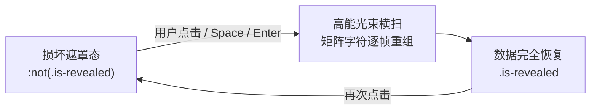

> **功能版本**：Telegram Spoiler Engine v1.0  
> **核心语法**：`||保密文本||` (与 Telegram 客户端语法 100% 对齐)  
> **视觉设计**：Material Design 3 动态色 + 赛博数据损坏（Cyber Glitch）+ 矩阵字符重组解码（Matrix Scramble）  
> **即时预览**：Telegram Instant View 2.0 原生 `<tg-spoiler>` 交互映射支持  

---

## 一、 为什么引入 Telegram 动态遮罩？

在日常技术写作、随笔与资讯分享中，我们经常遇到以下场景：

1. **防剧透需求**：分享电影、动漫、游戏或小说心得时，必须避免让未看过的读者被动接收关键剧情；
2. **敏感信息保密**：演示系统配置、密钥模板、私密备忘或内部代号时，提供安全直观的遮蔽交互；
3. **极客趣味交互**：相比于传统枯燥的黑条抹黑或简单虚化，融入**赛博数据损坏（Data Corruption）**与**黑客矩阵解码（Matrix Decryption）**动效，让点击阅读的过程犹如在科幻电影中破解并恢复破损数据。

---

## 二、 核心语法与基础演示

### 1. 基础单行遮罩

在 Markdown 中，只需像在 Telegram 聊天一样，用一对双竖线 `||文本||` 包裹内容即可生效：

* 电影剧情剧透：在《黑客帝国》中，主角 Neo 最终发现 ||人类所生活的现实世界其实是母体 Matrix 构建的神经交互仿真||，人类本体被泡在营养舱中发电。
* 系统默认凭据：数据库初始管理员账户为 `admin`，初始密码为 ||Admin#9920@Matrix_2026||，首次登录后请务必更改。
* 彩蛋内容：听说把本站所有文章看完，会触发 ||隐藏的宇宙终极答案：42|| 专属成就！

> [!TIP]
> **交互体验技巧**：点击上方任意被遮蔽的文本，文字会经历矩阵乱码字符（Scramble）高速计算并重组还原；解密完成后，**再次点击已揭示的文本**，可重新折叠回赛博损坏遮罩状态！

---

## 三、 动效技术与视觉细节



### 1. 动态色联动 (MD3 Dynamic Colors)
本功能深度接入了博客的 Material Design 3 动态色彩系统。遮罩的底色、边框微光、扫描线与字符置换时的荧光色，会**自动与当前生效的主题配色（蓝、紫、绿、橙、玫瑰、青）及亮暗色模式实时同步**：
* 亮色主题下：呈现清爽现代的微冷调半透明磨砂遮罩，解码时字体高亮为主题主色；
* 暗色主题下：呈现深邃冷酷的深黑赛博故障面板，伴随幽蓝/荧光高对比度扫描波纹。

### 2. 赛博数据损坏动态层 (Cyber Data Corruption)
处于遮罩态时，真实文本被高斯模糊与透明度完全屏蔽，表面覆有三层高拟真动态微动效：
1. **CRT 扫描光栅 (Scanlines)**：自上而下缓缓流动，模拟复古终端监视器的电子束扫描；
2. **数据坏块微颤 (Glitch Jitter)**：随机产生像素级细微位移与色散微抖动，模拟数据流传输中断；
3. **交互悬停激发 (Hover Volatility)**：鼠标悬停时，数据损坏活跃度加快闪烁，指示该扇区存在可读数据，引导读者点击恢复。

---

## 四、 复合场景与极限测试

### 1. 连续短词与密集遮罩

在同一段落中连续出现多个独立的遮罩时，每个遮罩均拥有独立的交互生命周期与解码线程：

* 极客硬件的随身四件套包括：||7 英寸迷你电脑||、||快充氮化镓电源||、||磁吸防丢触控笔|| 以及 ||米家防泼水多功能胸包||。
* 密码锁的三位验证码分别为：第一位是 ||7||，第二位是 ||3||，第三位是 ||9||。

### 2. 遮罩内部嵌套富文本 (Bold / Links)

Jekyll 预处理插件通过 `markdown="span"` 语义标记，完美保留了遮罩内部的加粗、斜体与超链接：

* 这是一段包含 ||**加粗重要指令** 与 [直达 Telegram 官方首页](https://telegram.org) 超链接|| 的复杂遮罩。在解密动画结束后，内部超链接可直接正常点击跳转！

### 3. 代码块安全隔离 (Code Protection)

我们在语法分析器中加入了严格的 AST 代码保护屏障，保证代码中的逻辑或运算（如 `||`）**绝对不会被误伤解析为遮罩**：

```javascript
// 代码中的双竖线保持绝对安全，不受任何影响
function checkPermission(user, role) {
  if (!user || user.role !== role) {
    console.warn("访问被拒绝");
    return false;
  }
  return true;
}
```

```bash
# Shell 命令行链式判断示例
ping -c 1 1.1.1.1 || echo "网络连接异常，启用备用网关"
```

---

## 五、 Telegram 即时预览 (Instant View) 原生对接

本功能不仅在网页端表现惊艳，同时已深度融入本站专属的 Telegram Instant View 2.0 规则引擎：

1. **自动语义转换**：XPath 规则（第 14 节）会在 Telegram 爬虫抓取文章时，自动将网页端的 `.tg-spoiler` 转换为 Telegram 官方原生的 `<tg-spoiler>` 标签；
2. **客户端原生交互**：当你在 Telegram 手机端或桌面端点击本文章的 **「⚡️ 即时预览 (Instant View)」** 按钮打开阅读时，所有遮罩均会呈现 Telegram 客户端原生带有繁星粒子流动、点击散开的官方遮罩效果！
3. **无障碍全覆盖**：支持键盘 `Tab` 键聚焦，按 `Enter` 或 `Space` 即可一键恢复数据。

快去文章上方点击几个遮罩体验一下吧！
